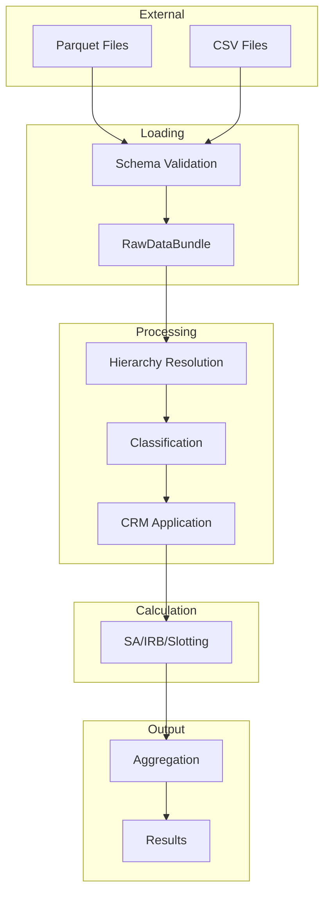

# Data Flow

This document describes how data flows through the RWA calculator, including schemas, transformations, and validation points.

## Data Flow Overview



## Input Data

### Required Files

| File | Description | Required |
|------|-------------|----------|
| `counterparties.parquet` | Counterparty master data | Yes |
| `facilities.parquet` | Credit facilities | Yes |
| `loans.parquet` | Individual loans/draws | Yes |

### Optional Files

| File | Description |
|------|-------------|
| `contingents.parquet` | Off-balance sheet items |
| `collateral.parquet` | Collateral details |
| `guarantees.parquet` | Guarantee information |
| `provisions.parquet` | Provision allocations |
| `ratings.parquet` | Credit ratings |
| `org_mapping.parquet` | Organization hierarchy |
| `lending_mapping.parquet` | Retail lending groups |

## Schema Definitions

### Counterparty Schema

```python
COUNTERPARTY_SCHEMA = {
    "counterparty_id": pl.Utf8,           # Required: Unique identifier
    "counterparty_name": pl.Utf8,         # Required: Legal name
    "counterparty_type": pl.Utf8,         # Required: SOVEREIGN/INSTITUTION/CORPORATE/INDIVIDUAL
    "country_code": pl.Utf8,              # Required: ISO country code
    "annual_turnover": pl.Float64,        # Optional: For SME classification
    "total_assets": pl.Float64,           # Optional: For SME classification
    "is_sme": pl.Boolean,                 # Optional: Explicit SME flag
    "parent_counterparty_id": pl.Utf8,    # Optional: Parent for hierarchy
}
```

### Facility Schema

```python
FACILITY_SCHEMA = {
    "facility_id": pl.Utf8,               # Required: Unique identifier
    "counterparty_id": pl.Utf8,           # Required: Link to counterparty
    "facility_type": pl.Utf8,             # Required: RCF/TERM/MORTGAGE/etc.
    "committed_amount": pl.Float64,       # Required: Total commitment
    "drawn_amount": pl.Float64,           # Required: Current utilization
    "currency": pl.Utf8,                  # Required: ISO currency code
    "start_date": pl.Date,                # Required: Facility start
    "maturity_date": pl.Date,             # Required: Final maturity
    "is_unconditionally_cancellable": pl.Boolean,  # Required: For CCF
}
```

### Loan Schema

```python
LOAN_SCHEMA = {
    "loan_id": pl.Utf8,                   # Required: Unique identifier
    "facility_id": pl.Utf8,               # Required: Link to facility
    "principal_amount": pl.Float64,       # Required: Outstanding principal
    "interest_rate": pl.Float64,          # Optional: Interest rate
    "is_defaulted": pl.Boolean,           # Required: Default indicator
    "days_past_due": pl.Int32,            # Required: DPD count
}
```

### Rating Schema

```python
RATING_SCHEMA = {
    "rating_id": pl.Utf8,                 # Required: Unique identifier
    "counterparty_id": pl.Utf8,           # Required: Link to counterparty
    "rating_agency": pl.Utf8,             # Required: S&P/MOODYS/FITCH/INTERNAL
    "rating": pl.Utf8,                    # Required: Rating value
    "rating_date": pl.Date,               # Required: As-of date
    "pd": pl.Float64,                     # Optional: Associated PD (for internal)
}
```

### Collateral Schema

```python
COLLATERAL_SCHEMA = {
    "collateral_id": pl.Utf8,             # Required: Unique identifier
    "counterparty_id": pl.Utf8,           # Optional: Counterparty-level allocation
    "facility_id": pl.Utf8,               # Optional: Facility-level allocation
    "loan_id": pl.Utf8,                   # Optional: Loan-level allocation
    "collateral_type": pl.Utf8,           # Required: CASH/BOND/EQUITY/RE/etc.
    "value": pl.Float64,                  # Required: Current value
    "currency": pl.Utf8,                  # Required: ISO currency code
    "issuer_cqs": pl.Int32,               # Optional: For bond collateral
    "residual_maturity_years": pl.Float64,  # Optional: For haircut calculation
}
```

## Data Transformations

### Stage 1: Loading

**Input:** Raw files
**Output:** `RawDataBundle`

Transformations:
- Load files as LazyFrames
- Validate against schemas
- Convert data types
- Add metadata columns

```python
# Example transformation
counterparties = (
    pl.scan_parquet(path / "counterparties.parquet")
    .with_columns(
        _load_timestamp=pl.lit(datetime.now()),
        _source_file=pl.lit("counterparties.parquet")
    )
)
```

### Stage 2: Hierarchy Resolution

**Input:** `RawDataBundle`
**Output:** `ResolvedHierarchyBundle`

Transformations:
- Resolve parent-child relationships
- Calculate aggregate exposures
- Inherit ratings
- Resolve lending groups

```python
# Hierarchy resolution adds columns
resolved = (
    exposures
    .with_columns(
        ultimate_parent_id=...,
        group_total_exposure=...,
        inherited_rating=...,
        inherited_cqs=...,
    )
)
```

### Stage 3: Classification

**Input:** `ResolvedHierarchyBundle`
**Output:** `ClassifiedExposuresBundle`

Transformations:
- Assign exposure class
- Determine calculation approach
- Calculate CCFs
- Calculate EAD

```python
# Classification adds columns
classified = (
    resolved
    .with_columns(
        exposure_class=...,
        approach_type=...,
        ccf=...,
        ead=pl.col("drawn_amount") + pl.col("undrawn_amount") * pl.col("ccf"),
    )
)
```

### Stage 4: CRM Processing

**Input:** `ClassifiedExposuresBundle`
**Output:** `CRMAdjustedBundle`

Transformations:
- Apply provision deductions
- Calculate collateral haircuts
- Apply guarantee substitution
- Calculate net exposure

```python
# CRM processing adds columns
crm_adjusted = (
    classified
    .with_columns(
        provision_amount=...,
        collateral_value=...,
        collateral_haircut=...,
        guaranteed_amount=...,
        guarantor_rw=...,
        net_ead=...,
    )
)
```

### Stage 5: RWA Calculation

**Input:** `CRMAdjustedBundle`
**Output:** Result bundles

Transformations:
- Look up risk weights (SA)
- Calculate K formula (IRB)
- Apply maturity adjustment
- Calculate RWA

```python
# SA calculation
sa_result = (
    sa_exposures
    .with_columns(
        risk_weight=...,
        supporting_factor=...,
        rwa=pl.col("ead") * pl.col("risk_weight") * pl.col("supporting_factor"),
    )
)

# IRB calculation
irb_result = (
    irb_exposures
    .with_columns(
        pd_floored=...,
        lgd_floored=...,
        correlation=...,
        k=...,
        maturity_adjustment=...,
        rwa=pl.col("k") * 12.5 * pl.col("ead") * pl.col("ma") * scaling,
        expected_loss=pl.col("pd") * pl.col("lgd") * pl.col("ead"),
    )
)
```

### Stage 6: Aggregation

**Input:** Result bundles
**Output:** `AggregatedResultBundle`

Transformations:
- Combine results from all approaches
- Apply output floor (Basel 3.1)
- Calculate totals and breakdowns

```python
# Aggregation
aggregated = (
    pl.concat([sa_result, irb_result, slotting_result])
    .with_columns(
        # Basel 3.1 output floor
        rwa_floored=pl.when(framework == "BASEL_3_1")
            .then(pl.max_horizontal("rwa", "sa_equivalent_rwa" * floor))
            .otherwise(pl.col("rwa"))
    )
)
```

## Data Validation

### Schema Validation

```python
def validate_schema(
    df: pl.LazyFrame,
    expected_schema: dict[str, pl.DataType]
) -> list[ValidationError]:
    """Validate DataFrame against expected schema."""
    errors = []

    for column, expected_type in expected_schema.items():
        if column not in df.columns:
            errors.append(ValidationError(
                field=column,
                message=f"Missing required column: {column}"
            ))
        elif df.schema[column] != expected_type:
            errors.append(ValidationError(
                field=column,
                message=f"Type mismatch: expected {expected_type}, got {df.schema[column]}"
            ))

    return errors
```

### Business Rule Validation

```python
def validate_exposure(exposure: dict) -> list[ValidationError]:
    """Validate exposure against business rules."""
    errors = []

    # EAD must be positive
    if exposure["ead"] <= 0:
        errors.append(ValidationError(
            field="ead",
            message="EAD must be positive"
        ))

    # PD must be in valid range
    if not (0 <= exposure["pd"] <= 1):
        errors.append(ValidationError(
            field="pd",
            message="PD must be between 0 and 1"
        ))

    return errors
```

## Output Data

### Result Schema

```python
RESULT_SCHEMA = {
    "exposure_id": pl.Utf8,
    "counterparty_id": pl.Utf8,
    "facility_id": pl.Utf8,
    "exposure_class": pl.Utf8,
    "approach_type": pl.Utf8,
    "ead": pl.Float64,
    "risk_weight": pl.Float64,
    "rwa": pl.Float64,
    "expected_loss": pl.Float64,  # IRB only
    "rwa_before_floor": pl.Float64,  # Basel 3.1
    "floor_impact": pl.Float64,  # Basel 3.1
}
```

### Export Formats

```python
# Export to various formats
result.to_parquet("results.parquet")
result.to_csv("results.csv")
result.to_json("results.json")

# Get as DataFrame
df = result.to_dataframe()
```

## Data Lineage

Every result can be traced back:

```python
# Access calculation details
details = result.get_calculation_details(exposure_id="E001")

print(f"Exposure: {details.exposure_id}")
print(f"Input EAD: {details.input_ead}")
print(f"CRM Adjustment: {details.crm_adjustment}")
print(f"Final EAD: {details.final_ead}")
print(f"Risk Weight: {details.risk_weight}")
print(f"Supporting Factor: {details.supporting_factor}")
print(f"Final RWA: {details.rwa}")
```

## Next Steps

- [Component Overview](components.md) - Individual components
- [API Reference](../api/index.md) - API documentation
- [Data Model](../data-model/index.md) - Complete schema reference
