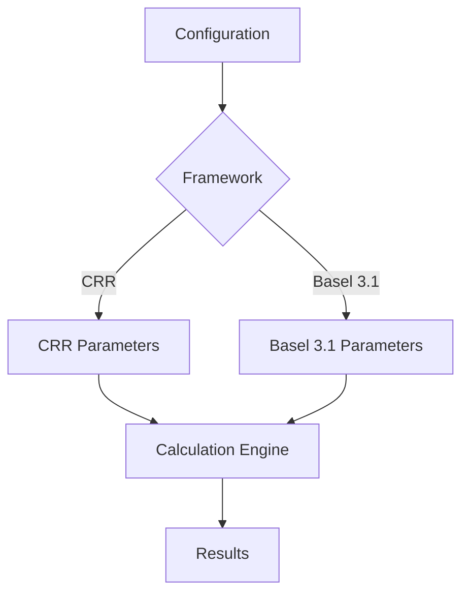
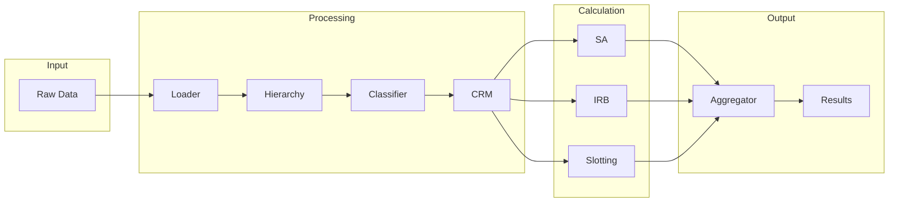

# Architecture Overview

This section provides detailed documentation of the RWA calculator's architecture for engineers and technical users.

## Design Philosophy

The calculator is built on several key principles:

### 1. Dual-Framework Support

A single codebase supports both CRR and Basel 3.1:



Framework differences are isolated to:
- Configuration factories
- Parameter lookups
- Supporting factor application
- Output floor calculation

### 2. Pipeline Architecture

Calculations flow through a well-defined pipeline:



### 3. Protocol-Based Interfaces

All components implement protocols for dependency injection:

```python
from typing import Protocol

class CalculatorProtocol(Protocol):
    def calculate(
        self,
        exposures: ClassifiedExposuresBundle,
        config: CalculationConfig
    ) -> ResultBundle:
        ...
```

### 4. Immutable Data Contracts

Data flows through immutable bundles:

```python
@dataclass(frozen=True)
class RawDataBundle:
    counterparties: pl.LazyFrame
    facilities: pl.LazyFrame
    loans: pl.LazyFrame
    # ... immutable after creation
```

### 5. LazyFrame Optimization

All processing uses Polars LazyFrames for performance:

```python
# Deferred execution
result = (
    df
    .filter(pl.col("exposure_class") == "CORPORATE")
    .with_columns(rwa=pl.col("ead") * pl.col("risk_weight"))
    .group_by("counterparty_id")
    .agg(pl.col("rwa").sum())
)  # Not executed yet

# Execute when needed
materialized = result.collect()
```

## Architecture Sections

- [**Design Principles**](design-principles.md) - Core architectural decisions
- [**Pipeline Architecture**](pipeline.md) - Detailed pipeline documentation
- [**Data Flow**](data-flow.md) - How data moves through the system
- [**Component Overview**](components.md) - Individual component documentation

## High-Level Structure

```
src/rwa_calc/
├── config/                 # Configuration (FX rates)
├── contracts/              # Interfaces and data contracts
│   ├── bundles.py         # Data transfer objects
│   ├── config.py          # Configuration classes
│   ├── errors.py          # Error handling
│   ├── protocols.py       # Component interfaces
│   └── validation.py      # Schema validation
├── data/                   # Schemas and regulatory tables
│   ├── schemas.py         # Polars schemas
│   └── tables/            # Lookup tables
├── domain/                 # Core domain
│   └── enums.py           # Enumerations
└── engine/                 # Calculation engine
    ├── pipeline.py        # Pipeline orchestration
    ├── loader.py          # Data loading
    ├── hierarchy.py       # Hierarchy resolution
    ├── classifier.py      # Exposure classification
    ├── ccf.py             # Credit conversion factors
    ├── aggregator.py      # Result aggregation
    ├── crm/               # Credit risk mitigation
    ├── sa/                # Standardised approach
    ├── irb/               # IRB approach
    └── slotting/          # Slotting approach
```

## Key Patterns

### Factory Method

Configuration uses factory methods for clarity:

```python
# Clear framework intent
config = CalculationConfig.crr(date(2026, 12, 31))
config = CalculationConfig.basel_3_1(date(2027, 1, 1))
```

### Strategy Pattern

Different approaches implement a common interface:

```python
# All calculators implement CalculatorProtocol
sa_calculator = SACalculator()
irb_calculator = IRBCalculator()
slotting_calculator = SlottingCalculator()

# Used interchangeably
for calculator in [sa_calculator, irb_calculator, slotting_calculator]:
    result = calculator.calculate(exposures, config)
```

### Builder Pattern

Complex objects built incrementally:

```python
result = (
    ResultBuilder()
    .add_sa_results(sa_results)
    .add_irb_results(irb_results)
    .add_slotting_results(slotting_results)
    .with_config(config)
    .build()
)
```

### Error Accumulation

Errors collected without exceptions:

```python
# Errors accumulated, not thrown
result = LazyFrameResult(
    data=processed_df,
    errors=[
        CalculationError(exposure_id="E001", message="Missing PD"),
        CalculationError(exposure_id="E002", message="Invalid LGD"),
    ]
)

# All exposures processed, errors reported at end
```

## Performance Characteristics

### LazyFrame Benefits

| Operation | DataFrame | LazyFrame |
|-----------|-----------|-----------|
| Memory | Eager allocation | On-demand |
| Execution | Immediate | Deferred |
| Optimization | Manual | Automatic |
| Parallelism | Limited | Full |

### Benchmark Results

For typical portfolio sizes:

| Exposures | LazyFrame | DataFrame | Speedup |
|-----------|-----------|-----------|---------|
| 10,000 | 0.2s | 0.5s | 2.5x |
| 100,000 | 0.8s | 5.2s | 6.5x |
| 1,000,000 | 3.5s | 45s | 12.9x |

## Technology Stack

| Component | Technology | Purpose |
|-----------|------------|---------|
| Data Processing | Polars | High-performance DataFrames |
| Validation | Pydantic | Type-safe data validation |
| Numerics | SciPy/NumPy | IRB formulas |
| Testing | Pytest | Comprehensive testing |
| Documentation | MkDocs | This documentation |

## Next Steps

- [Design Principles](design-principles.md) - Understand architectural decisions
- [Pipeline Architecture](pipeline.md) - Detailed pipeline documentation
- [API Reference](../api/index.md) - Component API documentation
