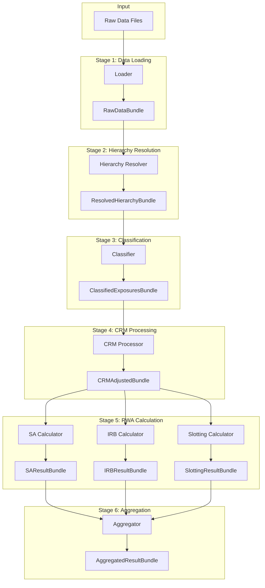

# Pipeline Architecture

The RWA calculator processes exposures through a well-defined pipeline with discrete stages. This document details each stage and how they interact.

## Pipeline Overview



## Pipeline Orchestration

The pipeline is orchestrated by `PipelineOrchestrator` (see [`pipeline.py:80-594`](https://github.com/OpenAfterHours/rwa_calculator/blob/master/src/rwa_calc/engine/pipeline.py#L80-L594)):

```python
from rwa_calc.engine.pipeline import create_pipeline

# Create pipeline with default components
pipeline = create_pipeline()

# Run with configuration
result = pipeline.run(config)

# Or with pre-loaded data
result = pipeline.run_with_data(raw_data, config)
```

### Pipeline Implementation

For full API documentation, see [Pipeline API Reference](../api/pipeline.md#pipelineorchestrator).

??? example "Full Implementation (pipeline.py)"
    ```python
    --8<-- "src/rwa_calc/engine/pipeline.py:80:261"
    ```

## Stage 1: Data Loading

### Purpose

Load raw data from Parquet/CSV files into LazyFrames.

### Input

File paths to data files.

### Output

`RawDataBundle` containing:
- `counterparties`: Counterparty master data
- `facilities`: Credit facility data
- `loans`: Individual loan/draw data
- `contingents`: Off-balance sheet items
- `collateral`: Collateral information
- `guarantees`: Guarantee data
- `provisions`: Provision allocations
- `ratings`: External and internal ratings
- `org_mapping`: Organization hierarchy
- `lending_mapping`: Retail lending groups

### Implementation

```python
class ParquetLoader:
    def load(self, path: Path) -> RawDataBundle:
        return RawDataBundle(
            counterparties=pl.scan_parquet(path / "counterparties.parquet"),
            facilities=pl.scan_parquet(path / "facilities.parquet"),
            loans=pl.scan_parquet(path / "loans.parquet"),
            # ... other data sources
        )
```

### Validation

- Schema validation against defined schemas
- Required field checks
- Data type validation

## Stage 2: Hierarchy Resolution

### Purpose

Resolve counterparty and facility hierarchies, inherit ratings and attributes.

### Input

`RawDataBundle`

### Output

`ResolvedHierarchyBundle` with:
- Resolved parent-child relationships
- Inherited ratings (from parent if not available)
- Aggregated exposures at counterparty level
- Lending group totals

### Implementation

The hierarchy resolution uses iterative Polars LazyFrame joins for performance. See [`hierarchy.py:208-277`](https://github.com/OpenAfterHours/rwa_calculator/blob/master/src/rwa_calc/engine/hierarchy.py#L208-L277) for the full implementation.

::: rwa_calc.engine.hierarchy.HierarchyResolver._build_ultimate_parent_lazy
    options:
      show_root_heading: false
      show_source: false

??? example "Actual Implementation (hierarchy.py)"
    ```python
    --8<-- "src/rwa_calc/engine/hierarchy.py:208:277"
    ```

### Rating Inheritance

Ratings are inherited from parent entities when not directly available. See [`hierarchy.py:279-381`](https://github.com/OpenAfterHours/rwa_calculator/blob/master/src/rwa_calc/engine/hierarchy.py#L279-L381).

The inheritance priority is:
1. Entity's own rating
2. Ultimate parent's rating
3. Mark as unrated

??? example "Actual Implementation (hierarchy.py)"
    ```python
    --8<-- "src/rwa_calc/engine/hierarchy.py:279:381"
    ```

## Stage 3: Classification

### Purpose

Assign exposure classes and determine calculation approach.

### Input

`ResolvedHierarchyBundle`

### Output

`ClassifiedExposuresBundle` with:
- `exposure_class`: Regulatory exposure class
- `approach`: SA, F-IRB, A-IRB, or Slotting
- Grouped exposures by approach

### Classification Logic

The classifier assigns exposure classes and calculation approaches. See [`classifier.py:195-244`](https://github.com/OpenAfterHours/rwa_calculator/blob/master/src/rwa_calc/engine/classifier.py#L195-L244) for the core classification logic.

::: rwa_calc.engine.classifier.ExposureClassifier
    options:
      show_root_heading: true
      members:
        - classify
      show_source: false

!!! info "Classification Priority Order"
    1. **Central Govt / Central Bank**: Government entities, central banks
    2. **RGLA**: Regional governments and local authorities
    3. **PSE**: Public sector entities
    4. **MDB**: Multilateral development banks
    5. **Institution**: Banks, regulated financial institutions, CCPs
    6. **Retail**: Individuals, small businesses meeting retail criteria
    7. **Corporate**: Non-financial corporates
    8. **Specialised Lending**: Project finance, object finance, etc.

??? example "Actual Implementation (classifier.py)"
    ```python
    --8<-- "src/rwa_calc/engine/classifier.py:195:244"
    ```

## Stage 4: CRM Processing

### Purpose

Apply credit risk mitigation: collateral, guarantees, provisions.

### Input

`ClassifiedExposuresBundle` plus CRM data

### Output

`CRMAdjustedBundle` with:
- Adjusted EAD values
- Applied haircuts
- Substituted risk weights (guarantees)
- Provision adjustments

### Processing Order

1. Apply specific provisions (reduce EAD)
2. Apply collateral with haircuts
3. Apply guarantees (substitution approach)

```python
def process_crm(
    exposures: pl.LazyFrame,
    collateral: pl.LazyFrame,
    guarantees: pl.LazyFrame,
    provisions: pl.LazyFrame,
    config: CalculationConfig
) -> pl.LazyFrame:
    """Apply CRM in correct order."""

    # Step 1: Provisions
    after_provisions = apply_provisions(exposures, provisions)

    # Step 2: Collateral
    after_collateral = apply_collateral_haircuts(
        after_provisions, collateral, config
    )

    # Step 3: Guarantees
    after_guarantees = apply_guarantee_substitution(
        after_collateral, guarantees, config
    )

    return after_guarantees
```

## Stage 5: RWA Calculation

### Purpose

Calculate RWA using appropriate approach for each exposure.

### SA Calculator

```python
class SACalculator:
    def calculate(
        self,
        exposures: pl.LazyFrame,
        config: CalculationConfig
    ) -> SAResultBundle:
        """Calculate SA RWA."""
        result = (
            exposures
            .with_columns(
                risk_weight=self._lookup_risk_weight(
                    pl.col("exposure_class"),
                    pl.col("cqs")
                )
            )
            .with_columns(
                rwa=pl.col("ead") * pl.col("risk_weight")
            )
        )

        # Apply supporting factors (CRR only)
        if config.framework == RegulatoryFramework.CRR:
            result = self._apply_supporting_factors(result, config)

        return SAResultBundle(data=result)
```

### IRB Calculator

```python
class IRBCalculator:
    def calculate(
        self,
        exposures: pl.LazyFrame,
        config: CalculationConfig
    ) -> IRBResultBundle:
        """Calculate IRB RWA."""
        result = (
            exposures
            .with_columns(
                # Apply PD floor
                pd_floored=pl.max_horizontal(
                    pl.col("pd"),
                    pl.lit(config.pd_floors.get_floor(pl.col("exposure_class")))
                )
            )
            .with_columns(
                # Calculate correlation
                correlation=self._calculate_correlation(
                    pl.col("exposure_class"),
                    pl.col("pd_floored"),
                    pl.col("turnover")
                ),
                # Calculate maturity adjustment
                ma=self._calculate_maturity_adjustment(
                    pl.col("pd_floored"),
                    pl.col("effective_maturity")
                )
            )
            .with_columns(
                # Calculate K
                k=self._calculate_k(
                    pl.col("pd_floored"),
                    pl.col("lgd"),
                    pl.col("correlation")
                )
            )
            .with_columns(
                # Calculate RWA
                rwa=pl.col("k") * 12.5 * pl.col("ead") * pl.col("ma") *
                    config.scaling_factor
            )
        )

        return IRBResultBundle(data=result)
```

### Slotting Calculator

```python
class SlottingCalculator:
    def calculate(
        self,
        exposures: pl.LazyFrame,
        config: CalculationConfig
    ) -> SlottingResultBundle:
        """Calculate Slotting RWA."""
        result = (
            exposures
            .with_columns(
                risk_weight=self._lookup_slotting_weight(
                    pl.col("lending_type"),
                    pl.col("slotting_category"),
                    config.framework
                )
            )
            .with_columns(
                rwa=pl.col("ead") * pl.col("risk_weight")
            )
        )

        return SlottingResultBundle(data=result)
```

## Stage 6: Aggregation

### Purpose

Combine results, apply output floor, produce final output.

### Input

Result bundles from all calculators

### Output

`AggregatedResultBundle` with:
- Total RWA
- RWA by approach
- RWA by exposure class
- Floor impact (Basel 3.1)
- Detailed breakdown

### Output Floor (Basel 3.1)

```python
def apply_output_floor(
    irb_rwa: pl.LazyFrame,
    sa_rwa: pl.LazyFrame,
    floor_percentage: float
) -> pl.LazyFrame:
    """Apply output floor to IRB results."""
    return (
        irb_rwa
        .join(sa_rwa, on="exposure_id", suffix="_sa")
        .with_columns(
            floor=pl.col("rwa_sa") * floor_percentage,
            rwa_floored=pl.max_horizontal(
                pl.col("rwa"),
                pl.col("rwa_sa") * floor_percentage
            )
        )
    )
```

## Error Handling

Each stage accumulates errors:

```python
@dataclass
class StageResult:
    data: pl.LazyFrame
    errors: list[CalculationError]
    warnings: list[CalculationWarning]

# Pipeline accumulates across stages
all_errors = []
all_errors.extend(loader_result.errors)
all_errors.extend(hierarchy_result.errors)
# ... etc.
```

## Next Steps

- [Data Flow](data-flow.md) - Detailed data flow documentation
- [Component Overview](components.md) - Individual component details
- [API Reference](../api/pipeline.md) - Pipeline API documentation
