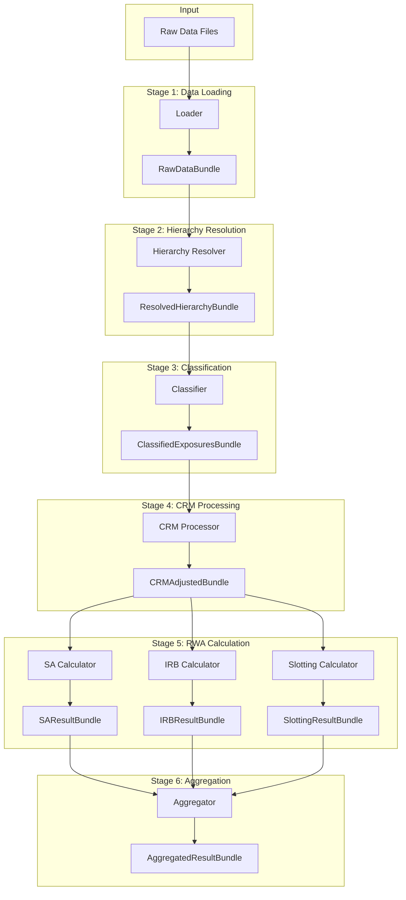

# Pipeline Architecture

The RWA calculator processes exposures through a well-defined pipeline with discrete stages. This document details each stage and how they interact.

## Pipeline Overview



## Pipeline Orchestration

The pipeline is orchestrated by `RWAPipeline`:

```python
from rwa_calc.engine.pipeline import RWAPipeline, create_pipeline

# Create pipeline with default components
pipeline = create_pipeline()

# Run with configuration
result = pipeline.run(config)

# Or with pre-loaded data
result = pipeline.run_with_data(raw_data, config)
```

### Pipeline Implementation

```python
class RWAPipeline:
    def __init__(
        self,
        loader: LoaderProtocol,
        hierarchy_resolver: HierarchyResolverProtocol,
        classifier: ClassifierProtocol,
        crm_processor: CRMProcessorProtocol,
        sa_calculator: SACalculatorProtocol,
        irb_calculator: IRBCalculatorProtocol,
        slotting_calculator: SlottingCalculatorProtocol,
        aggregator: OutputAggregatorProtocol,
    ):
        self._loader = loader
        self._hierarchy_resolver = hierarchy_resolver
        # ... other components

    def run(self, config: CalculationConfig) -> AggregatedResultBundle:
        """Run the complete pipeline."""
        # Stage 1: Load data
        raw_data = self._loader.load(config.data_path)

        # Stage 2: Resolve hierarchies
        resolved = self._hierarchy_resolver.resolve(raw_data, config)

        # Stage 3: Classify exposures
        classified = self._classifier.classify(resolved, config)

        # Stage 4: Apply CRM
        crm_adjusted = self._crm_processor.process(classified, config)

        # Stage 5: Calculate RWA by approach
        sa_result = self._sa_calculator.calculate(
            crm_adjusted.sa_exposures, config
        )
        irb_result = self._irb_calculator.calculate(
            crm_adjusted.irb_exposures, config
        )
        slotting_result = self._slotting_calculator.calculate(
            crm_adjusted.slotting_exposures, config
        )

        # Stage 6: Aggregate results
        return self._aggregator.aggregate(
            sa_result, irb_result, slotting_result, config
        )
```

## Stage 1: Data Loading

### Purpose

Load raw data from Parquet/CSV files into LazyFrames.

### Input

File paths to data files.

### Output

`RawDataBundle` containing:
- `counterparties`: Counterparty master data
- `facilities`: Credit facility data
- `loans`: Individual loan/draw data
- `contingents`: Off-balance sheet items
- `collateral`: Collateral information
- `guarantees`: Guarantee data
- `provisions`: Provision allocations
- `ratings`: External and internal ratings
- `org_mapping`: Organization hierarchy
- `lending_mapping`: Retail lending groups

### Implementation

```python
class ParquetLoader:
    def load(self, path: Path) -> RawDataBundle:
        return RawDataBundle(
            counterparties=pl.scan_parquet(path / "counterparties.parquet"),
            facilities=pl.scan_parquet(path / "facilities.parquet"),
            loans=pl.scan_parquet(path / "loans.parquet"),
            # ... other data sources
        )
```

### Validation

- Schema validation against defined schemas
- Required field checks
- Data type validation

## Stage 2: Hierarchy Resolution

### Purpose

Resolve counterparty and facility hierarchies, inherit ratings and attributes.

### Input

`RawDataBundle`

### Output

`ResolvedHierarchyBundle` with:
- Resolved parent-child relationships
- Inherited ratings (from parent if not available)
- Aggregated exposures at counterparty level
- Lending group totals

### Implementation

Uses iterative joins for performance:

```python
def resolve_counterparty_hierarchy(
    counterparties: pl.LazyFrame,
    org_mapping: pl.LazyFrame
) -> pl.LazyFrame:
    """Resolve counterparty parent-child relationships."""
    resolved = counterparties

    # Iteratively resolve up to max depth
    for _ in range(MAX_HIERARCHY_DEPTH):
        resolved = (
            resolved
            .join(
                org_mapping,
                left_on="parent_id",
                right_on="child_id",
                how="left"
            )
            .with_columns(
                parent_id=pl.coalesce("parent_id_right", "parent_id")
            )
        )

    return resolved
```

### Rating Inheritance

```python
def inherit_ratings(
    exposures: pl.LazyFrame,
    ratings: pl.LazyFrame,
    hierarchy: pl.LazyFrame
) -> pl.LazyFrame:
    """Inherit ratings from parent if not available."""
    return (
        exposures
        .join(ratings, on="counterparty_id", how="left")
        .with_columns(
            effective_rating=pl.coalesce(
                "own_rating",
                "parent_rating",
                "ultimate_parent_rating"
            )
        )
    )
```

## Stage 3: Classification

### Purpose

Assign exposure classes and determine calculation approach.

### Input

`ResolvedHierarchyBundle`

### Output

`ClassifiedExposuresBundle` with:
- `exposure_class`: Regulatory exposure class
- `approach`: SA, F-IRB, A-IRB, or Slotting
- Grouped exposures by approach

### Classification Logic

```python
def classify_exposure(
    counterparty_type: str,
    total_exposure: float,
    product_type: str,
    is_defaulted: bool,
    config: CalculationConfig
) -> tuple[ExposureClass, ApproachType]:
    """Classify exposure and determine approach."""

    # Check default status first
    if is_defaulted:
        return ExposureClass.DEFAULTED, determine_approach(...)

    # Classify by counterparty type
    if counterparty_type == "SOVEREIGN":
        return ExposureClass.SOVEREIGN, ApproachType.SA

    if counterparty_type == "INSTITUTION":
        return ExposureClass.INSTITUTION, determine_approach(...)

    if counterparty_type in ["INDIVIDUAL", "SMALL_BUSINESS"]:
        if is_retail_eligible(total_exposure, config):
            return classify_retail(product_type), ApproachType.AIRB

    # Corporate classification
    if is_sme(counterparty):
        return ExposureClass.CORPORATE_SME, determine_approach(...)

    return ExposureClass.CORPORATE, determine_approach(...)
```

## Stage 4: CRM Processing

### Purpose

Apply credit risk mitigation: collateral, guarantees, provisions.

### Input

`ClassifiedExposuresBundle` plus CRM data

### Output

`CRMAdjustedBundle` with:
- Adjusted EAD values
- Applied haircuts
- Substituted risk weights (guarantees)
- Provision adjustments

### Processing Order

1. Apply specific provisions (reduce EAD)
2. Apply collateral with haircuts
3. Apply guarantees (substitution approach)

```python
def process_crm(
    exposures: pl.LazyFrame,
    collateral: pl.LazyFrame,
    guarantees: pl.LazyFrame,
    provisions: pl.LazyFrame,
    config: CalculationConfig
) -> pl.LazyFrame:
    """Apply CRM in correct order."""

    # Step 1: Provisions
    after_provisions = apply_provisions(exposures, provisions)

    # Step 2: Collateral
    after_collateral = apply_collateral_haircuts(
        after_provisions, collateral, config
    )

    # Step 3: Guarantees
    after_guarantees = apply_guarantee_substitution(
        after_collateral, guarantees, config
    )

    return after_guarantees
```

## Stage 5: RWA Calculation

### Purpose

Calculate RWA using appropriate approach for each exposure.

### SA Calculator

```python
class SACalculator:
    def calculate(
        self,
        exposures: pl.LazyFrame,
        config: CalculationConfig
    ) -> SAResultBundle:
        """Calculate SA RWA."""
        result = (
            exposures
            .with_columns(
                risk_weight=self._lookup_risk_weight(
                    pl.col("exposure_class"),
                    pl.col("cqs")
                )
            )
            .with_columns(
                rwa=pl.col("ead") * pl.col("risk_weight")
            )
        )

        # Apply supporting factors (CRR only)
        if config.framework == RegulatoryFramework.CRR:
            result = self._apply_supporting_factors(result, config)

        return SAResultBundle(data=result)
```

### IRB Calculator

```python
class IRBCalculator:
    def calculate(
        self,
        exposures: pl.LazyFrame,
        config: CalculationConfig
    ) -> IRBResultBundle:
        """Calculate IRB RWA."""
        result = (
            exposures
            .with_columns(
                # Apply PD floor
                pd_floored=pl.max_horizontal(
                    pl.col("pd"),
                    pl.lit(config.pd_floors.get_floor(pl.col("exposure_class")))
                )
            )
            .with_columns(
                # Calculate correlation
                correlation=self._calculate_correlation(
                    pl.col("exposure_class"),
                    pl.col("pd_floored"),
                    pl.col("turnover")
                ),
                # Calculate maturity adjustment
                ma=self._calculate_maturity_adjustment(
                    pl.col("pd_floored"),
                    pl.col("effective_maturity")
                )
            )
            .with_columns(
                # Calculate K
                k=self._calculate_k(
                    pl.col("pd_floored"),
                    pl.col("lgd"),
                    pl.col("correlation")
                )
            )
            .with_columns(
                # Calculate RWA
                rwa=pl.col("k") * 12.5 * pl.col("ead") * pl.col("ma") *
                    config.scaling_factor
            )
        )

        return IRBResultBundle(data=result)
```

### Slotting Calculator

```python
class SlottingCalculator:
    def calculate(
        self,
        exposures: pl.LazyFrame,
        config: CalculationConfig
    ) -> SlottingResultBundle:
        """Calculate Slotting RWA."""
        result = (
            exposures
            .with_columns(
                risk_weight=self._lookup_slotting_weight(
                    pl.col("lending_type"),
                    pl.col("slotting_category"),
                    config.framework
                )
            )
            .with_columns(
                rwa=pl.col("ead") * pl.col("risk_weight")
            )
        )

        return SlottingResultBundle(data=result)
```

## Stage 6: Aggregation

### Purpose

Combine results, apply output floor, produce final output.

### Input

Result bundles from all calculators

### Output

`AggregatedResultBundle` with:
- Total RWA
- RWA by approach
- RWA by exposure class
- Floor impact (Basel 3.1)
- Detailed breakdown

### Output Floor (Basel 3.1)

```python
def apply_output_floor(
    irb_rwa: pl.LazyFrame,
    sa_rwa: pl.LazyFrame,
    floor_percentage: float
) -> pl.LazyFrame:
    """Apply output floor to IRB results."""
    return (
        irb_rwa
        .join(sa_rwa, on="exposure_id", suffix="_sa")
        .with_columns(
            floor=pl.col("rwa_sa") * floor_percentage,
            rwa_floored=pl.max_horizontal(
                pl.col("rwa"),
                pl.col("rwa_sa") * floor_percentage
            )
        )
    )
```

## Error Handling

Each stage accumulates errors:

```python
@dataclass
class StageResult:
    data: pl.LazyFrame
    errors: list[CalculationError]
    warnings: list[CalculationWarning]

# Pipeline accumulates across stages
all_errors = []
all_errors.extend(loader_result.errors)
all_errors.extend(hierarchy_result.errors)
# ... etc.
```

## Next Steps

- [Data Flow](data-flow.md) - Detailed data flow documentation
- [Component Overview](components.md) - Individual component details
- [API Reference](../api/pipeline.md) - Pipeline API documentation
