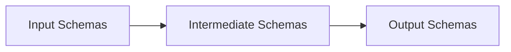

# Data Model

This section documents the data schemas used throughout the RWA calculator, including input requirements, intermediate structures, and output formats.

## Overview

The calculator uses Polars schemas to define and validate data at each stage:



## Schema Categories

### Input Schemas

Define the structure of data loaded from external sources:

- [**Input Schemas**](input-schemas.md)
  - Counterparty Schema
  - Facility Schema
  - Loan Schema
  - Collateral Schema
  - Guarantee Schema
  - Provision Schema
  - Rating Schema
  - Mapping Schemas

### Intermediate Schemas

Define internal data structures used during processing:

- [**Intermediate Schemas**](intermediate-schemas.md)
  - Resolved Hierarchy Schema
  - Classified Exposure Schema
  - CRM Adjusted Schema

### Output Schemas

Define the structure of calculation results:

- [**Output Schemas**](output-schemas.md)
  - SA Result Schema
  - IRB Result Schema
  - Slotting Result Schema
  - Aggregated Result Schema

### Regulatory Tables

Lookup tables for risk weights and parameters:

- [**Regulatory Tables**](regulatory-tables.md)
  - Risk Weight Tables
  - CCF Tables
  - Haircut Tables
  - Slotting Tables
  - F-IRB LGD Tables

## Schema Usage

### Validation

```python
from rwa_calc.data.schemas import COUNTERPARTY_SCHEMA
from rwa_calc.contracts.validation import validate_schema

# Validate data against schema
errors = validate_schema(counterparty_df, COUNTERPARTY_SCHEMA)

if errors:
    for error in errors:
        print(f"Validation error: {error}")
```

### Type Checking

```python
import polars as pl
from rwa_calc.data.schemas import FACILITY_SCHEMA

# Create DataFrame with explicit schema
facilities = pl.DataFrame({
    "facility_id": ["F001", "F002"],
    "counterparty_id": ["C001", "C001"],
    "committed_amount": [1_000_000.0, 500_000.0],
}).cast(FACILITY_SCHEMA)
```

## Data Types

| Polars Type | Python Type | Usage |
|-------------|-------------|-------|
| `pl.Utf8` | `str` | IDs, names, codes |
| `pl.Float64` | `float` | Amounts, rates, weights |
| `pl.Int32` | `int` | Counts, CQS values |
| `pl.Boolean` | `bool` | Flags, indicators |
| `pl.Date` | `date` | Dates |
| `pl.Datetime` | `datetime` | Timestamps |

## Nullable Fields

Optional fields are marked with `| None` in schemas:

```python
COUNTERPARTY_SCHEMA = {
    "counterparty_id": pl.Utf8,          # Required
    "annual_turnover": pl.Float64,        # Optional (can be null)
    "parent_id": pl.Utf8,                 # Optional
}
```

## Next Steps

- [Input Schemas](input-schemas.md) - Required input data formats
- [Output Schemas](output-schemas.md) - Result data formats
- [Regulatory Tables](regulatory-tables.md) - Lookup table reference
