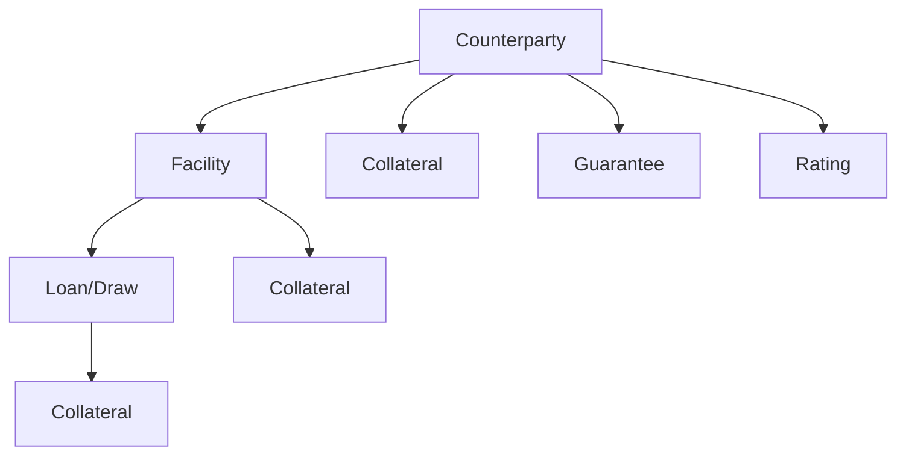

# Key Concepts

This page introduces the fundamental concepts used throughout the RWA calculator. Understanding these terms is essential for working with the system effectively.

## Risk-Weighted Assets (RWA)

**Risk-Weighted Assets (RWA)** are a measure of a bank's assets, adjusted for risk. They are used to determine the minimum capital a bank must hold to remain solvent.

```
Capital Ratio = Regulatory Capital / RWA
```

The higher the risk of an asset, the higher its risk weight, and the more capital required.

### Example

| Asset | Value | Risk Weight | RWA |
|-------|-------|-------------|-----|
| UK Government Bond | £100m | 0% | £0m |
| Corporate Loan (AAA) | £100m | 20% | £20m |
| Corporate Loan (Unrated) | £100m | 100% | £100m |

## Regulatory Frameworks

### CRR (Capital Requirements Regulation)

The **CRR** implements Basel 3.0 standards in the UK. It is the current regulatory framework, effective until 31 December 2026.

Key features:
- 1.06 scaling factor for IRB approaches
- SME Supporting Factor (Article 501)
- Infrastructure Supporting Factor
- No output floor

### Basel 3.1

**Basel 3.1** (implemented via PRA PS9/24) introduces enhanced risk sensitivity and removes certain capital relief mechanisms. Effective from 1 January 2027.

Key features:
- Removal of 1.06 scaling factor
- Removal of supporting factors
- Introduction of 72.5% output floor
- Differentiated PD floors
- A-IRB LGD floors

## Calculation Approaches

### Standardised Approach (SA)

The **Standardised Approach** uses regulatory-prescribed risk weights based on:
- External credit ratings (where available)
- Exposure class characteristics
- Collateral type

```
RWA = EAD × Risk Weight
```

**Advantages**: Simple, transparent, consistent across institutions
**Disadvantages**: Less risk-sensitive than IRB approaches

### Foundation IRB (F-IRB)

The **Foundation Internal Ratings-Based** approach allows banks to estimate:
- **PD** (Probability of Default) - Bank's own estimate
- **LGD** (Loss Given Default) - Supervisory values
- **EAD** (Exposure at Default) - Supervisory rules

```
RWA = K × 12.5 × EAD × Maturity Adjustment × [1.06 if CRR]
```

Where K is calculated using the IRB formula.

### Advanced IRB (A-IRB)

The **Advanced Internal Ratings-Based** approach allows banks to estimate:
- **PD** - Bank's own estimate
- **LGD** - Bank's own estimate
- **EAD** - Bank's own estimate

This provides the most risk-sensitive calculation but requires regulatory approval.

### Slotting Approach

The **Slotting Approach** applies to Specialised Lending exposures where the bank cannot estimate PD:
- Project Finance
- Object Finance
- Commodities Finance
- Income-Producing Real Estate (IPRE)
- High Volatility Commercial Real Estate (HVCRE)

Exposures are mapped to categories (Strong, Good, Satisfactory, Weak, Default) with prescribed risk weights.

## Exposure Classes

Exposures are classified into regulatory categories based on the counterparty's **entity type**:

| Class | Description | Typical Risk |
|-------|-------------|--------------|
| **Sovereign** | Governments and central banks | Low-High |
| **RGLA** | Regional governments, local authorities | Low-Medium |
| **PSE** | Public sector entities | Low-Medium |
| **MDB** | Multilateral development banks | Low |
| **Institution** | Banks, CCPs, financial institutions | Medium |
| **Corporate** | Non-retail companies | Medium-High |
| **Corporate SME** | Small/medium enterprises (<EUR 50m revenue) | Medium |
| **Retail Mortgage** | Residential mortgages | Low-Medium |
| **Retail QRRE** | Qualifying revolving retail | Medium |
| **Retail Other** | Other retail exposures | Medium-High |
| **Specialised Lending** | Project finance, object finance, IPRE | Variable |
| **Equity** | Equity holdings | High |
| **Defaulted** | Non-performing exposures | Very High |

### Entity Type Classification

The counterparty's `entity_type` field is the **single source of truth** for exposure class determination. The calculator supports 17 entity types that map to both SA and IRB exposure classes.

For example:
- `pse_sovereign` maps to PSE for SA (uses PSE risk weight table) but SOVEREIGN for IRB (uses sovereign formula)
- `mdb` maps to MDB for SA (typically 0% RW) but SOVEREIGN for IRB

See [Classification](../features/classification.md) for the complete entity type mapping and classification algorithm.

## Key Metrics

### EAD (Exposure at Default)

The **Exposure at Default** is the expected exposure amount if the counterparty defaults.

For on-balance sheet items:
```
EAD = Drawn Amount
```

For off-balance sheet items:
```
EAD = Committed Amount × CCF
```

Where **CCF** (Credit Conversion Factor) converts undrawn commitments to on-balance sheet equivalents.

### PD (Probability of Default)

The **Probability of Default** is the likelihood that a counterparty will default within one year. Used in IRB approaches.

- Range: 0.03% to 100%
- Floor depends on framework and exposure class

### LGD (Loss Given Default)

The **Loss Given Default** is the percentage of exposure lost if default occurs, after recoveries.

| Approach | LGD Source |
|----------|------------|
| SA | Not used (embedded in risk weight) |
| F-IRB | Supervisory values (0%, 35%, 45%, 75%) |
| A-IRB | Bank estimates (subject to floors) |

### CCF (Credit Conversion Factor)

The **Credit Conversion Factor** converts off-balance sheet exposures to on-balance sheet equivalents.

| Item Type | CCF |
|-----------|-----|
| Unconditionally cancellable | 0% |
| Trade finance | 20% |
| Note issuance facilities | 50% |
| Direct credit substitutes | 100% |

## Credit Risk Mitigation (CRM)

CRM techniques reduce the capital required for an exposure:

### Collateral

Physical or financial assets securing an exposure. Subject to haircuts:

| Collateral Type | Haircut |
|-----------------|---------|
| Cash (same currency) | 0% |
| Government bonds | 0-4% |
| Corporate bonds | 1-15% |
| Equity | 15-25% |

Plus 8% currency mismatch haircut if applicable.

### Guarantees

Credit protection provided by a third party. The exposure can be treated as if it were to the guarantor (substitution approach).

### Provisions

Specific provisions reduce EAD for SA exposures or expected loss for IRB exposures.

## Data Hierarchy

Exposures follow a hierarchical structure:



- **Counterparty**: The obligor (borrower)
- **Facility**: A credit arrangement (e.g., credit line)
- **Loan**: Individual draws or tranches

Ratings and collateral can be assigned at any level and inherit down the hierarchy.

## Pipeline Stages

The calculation flows through distinct stages:

1. **Loader**: Reads raw data from files
2. **Hierarchy Resolver**: Resolves parent-child relationships and inherits attributes
3. **Classifier**: Assigns exposure classes and calculation approaches
4. **CRM Processor**: Applies collateral, guarantees, and provisions
5. **Calculators**: Compute RWA using SA, IRB, or Slotting
6. **Aggregator**: Combines results and applies floors/factors

## Next Steps

- [Regulatory Frameworks](../user-guide/regulatory/index.md) - Deep dive into CRR and Basel 3.1
- [Calculation Methodology](../user-guide/methodology/index.md) - Detailed calculation explanations
- [Data Model](../data-model/index.md) - Input and output data structures
