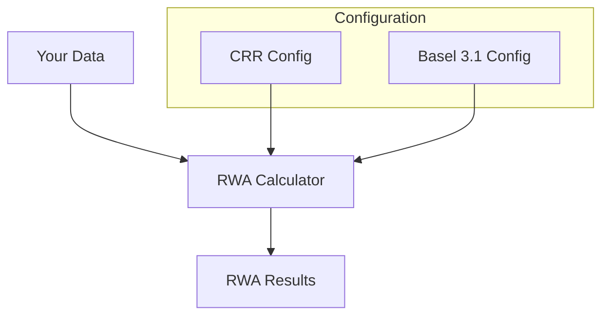

# Getting Started

This section will help you get up and running with the UK Credit Risk RWA Calculator quickly.

## Prerequisites

Before you begin, ensure you have:

- **Python 3.13+** installed
- **uv** package manager (recommended) or pip
- Access to your exposure data in Parquet or CSV format

## What You'll Learn

1. [**Installation**](installation.md) - How to install the calculator and its dependencies
2. [**Quick Start**](quickstart.md) - Run your first RWA calculation in minutes
3. [**Concepts**](concepts.md) - Understand the key concepts and terminology

## Overview

The RWA calculator processes your credit exposure data through a pipeline that:

1. **Loads** raw data from Parquet/CSV files
2. **Resolves** counterparty and facility hierarchies
3. **Classifies** exposures into regulatory exposure classes
4. **Applies** credit risk mitigation (CRM)
5. **Calculates** RWA using SA, IRB, or Slotting approaches
6. **Aggregates** results with supporting factors and output floors



## Quick Example

```python
from datetime import date
from rwa_calc.engine.pipeline import create_pipeline
from rwa_calc.contracts.config import CalculationConfig

# Create configuration for CRR framework
config = CalculationConfig.crr(reporting_date=date(2026, 12, 31))

# Create and run the pipeline
pipeline = create_pipeline()
result = pipeline.run(config)

# Access results
print(f"Total RWA: {result.total_rwa:,.2f}")
print(f"By approach: {result.by_approach}")
```

## Next Steps

- New to RWA calculations? Start with [Concepts](concepts.md)
- Ready to install? Go to [Installation](installation.md)
- Want to jump right in? Try the [Quick Start](quickstart.md)
