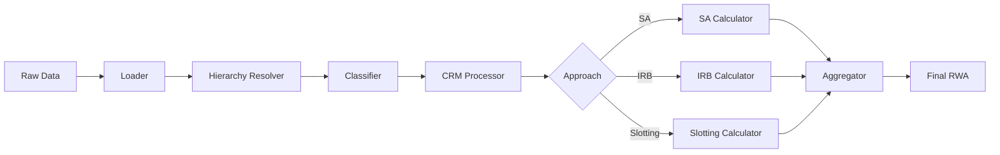

# UK Credit Risk RWA Calculator

Welcome to the documentation for the **UK Credit Risk RWA Calculator** - a high-performance system for calculating Risk-Weighted Assets (RWA) for UK credit risk exposures.

!!! warning "Development Status"
    This package is still in development and is not yet production ready. APIs may change between versions.

**Documentation:** [https://OpenAfterHours.github.io/rwa_calculator/](https://OpenAfterHours.github.io/rwa_calculator/)

**Source Code:** [https://github.com/OpenAfterHours/rwa_calculator](https://github.com/OpenAfterHours/rwa_calculator)

## Overview

This calculator supports both current and forthcoming UK regulatory frameworks:

| Framework | Status | Effective Date |
|-----------|--------|----------------|
| **CRR (Basel 3.0)** | Active | Until 31 December 2026 |
| **Basel 3.1 (PRA PS9/24)** | Planned | From 1 January 2027 |

The system provides accurate, auditable RWA calculations across all major exposure classes using both the Standardised Approach (SA) and Internal Ratings-Based (IRB) approaches.

## Key Features

- **Dual-Framework Support**: Single codebase supporting both CRR and Basel 3.1 regulations
- **High Performance**: Built on Polars LazyFrames for vectorized operations, achieving 50-100x performance improvements
- **Full Regulatory Coverage**: Implements all exposure classes including Central Govt / Central Bank, Institution, Corporate, Retail, and Specialised Lending
- **Credit Risk Mitigation**: Complete CRM support including collateral, guarantees, and provisions
- **Audit Trail**: Error accumulation and full traceability for regulatory compliance
- **Extensible Architecture**: Protocol-based design enabling easy customization

## Who Is This Documentation For?

This documentation serves multiple audiences:

### For Engineers

- [**Architecture Guide**](architecture/index.md) - Understand the system design and components
- [**API Reference**](api/index.md) - Complete API documentation for all modules
- [**Development Guide**](development/index.md) - Testing, extending, and contributing

### For Risk & Audit Teams

- [**Regulatory Frameworks**](user-guide/regulatory/index.md) - Detailed coverage of CRR and Basel 3.1 requirements
- [**Calculation Methodology**](user-guide/methodology/index.md) - How RWAs are calculated
- [**Exposure Classes**](user-guide/exposure-classes/index.md) - Classification and treatment of exposures

### For Business Users

- [**Getting Started**](getting-started/index.md) - Quick introduction and setup
- [**User Guide**](user-guide/index.md) - Comprehensive usage documentation
- [**Glossary**](appendix/glossary.md) - Terminology and definitions

## Quick Navigation

-   :material-rocket-launch:{ .lg .middle } **Getting Started**

    ---

    Install the calculator and run your first RWA calculation

    [:octicons-arrow-right-24: Quick Start](getting-started/quickstart.md)

-   :material-scale-balance:{ .lg .middle } **Regulatory Frameworks**

    ---

    Understand CRR and Basel 3.1 regulatory requirements

    [:octicons-arrow-right-24: Regulations](user-guide/regulatory/index.md)

-   :material-calculator:{ .lg .middle } **Calculation Methods**

    ---

    Learn how SA, IRB, and CRM calculations work

    [:octicons-arrow-right-24: Methodology](user-guide/methodology/index.md)

-   :material-code-braces:{ .lg .middle } **API Reference**

    ---

    Complete technical documentation for developers

    [:octicons-arrow-right-24: API Docs](api/index.md)

## Calculation Pipeline Overview

The RWA calculator processes exposures through a well-defined pipeline:

## Supported Calculations

### By Approach

| Approach | Description | Framework Support |
|----------|-------------|-------------------|
| **Standardised (SA)** | Risk weights based on external ratings and exposure characteristics | CRR, Basel 3.1 |
| **Foundation IRB (F-IRB)** | Bank-estimated PD, supervisory LGD | CRR, Basel 3.1 |
| **Advanced IRB (A-IRB)** | Bank-estimated PD, LGD, and EAD | CRR, Basel 3.1 |
| **Slotting** | Category-based approach for specialised lending | CRR, Basel 3.1 |

### By Exposure Class

| Class | SA | F-IRB | A-IRB | Slotting |
|-------|:--:|:-----:|:-----:|:--------:|
| Central Govt / Central Bank | :white_check_mark: | :white_check_mark: | :white_check_mark: | |
| Institution | :white_check_mark: | :white_check_mark: | :white_check_mark: | |
| Corporate | :white_check_mark: | :white_check_mark: | :white_check_mark: | |
| Corporate SME | :white_check_mark: | :white_check_mark: | :white_check_mark: | |
| Retail Mortgage | :white_check_mark: | | :white_check_mark: | |
| Retail QRRE | :white_check_mark: | | :white_check_mark: | |
| Retail Other | :white_check_mark: | | :white_check_mark: | |
| Specialised Lending | | | | :white_check_mark: |
| Equity | :white_check_mark: | :white_check_mark: | | |

## Technology Stack

The calculator is built using modern, high-performance technologies:

- **Python 3.13+** - Latest Python features
- **Polars** - Vectorized DataFrame operations with LazyFrame optimization
- **Pydantic** - Data validation and type safety
- **polars-normal-stats** - Pure Polars statistical functions for IRB formulas
- **Pytest** - Comprehensive test coverage (800+ tests)

## Regulatory References

This implementation follows:

- **PRA Rulebook** - CRR Firms rules
- **UK CRR** - EU 575/2013 as onshored
- **PRA PS9/24** - Basel 3.1 implementation policy statement
- **BCBS CRE Standards** - Basel Committee credit risk standards

See the [Regulatory References](appendix/regulatory-references.md) appendix for complete documentation links.

## Version Information

| Component | Version |
|-----------|---------|
| Calculator | 0.1.14 |
| CRR Support | Full |
| Basel 3.1 Support | In Development |
| Python Required | >= 3.13 |
