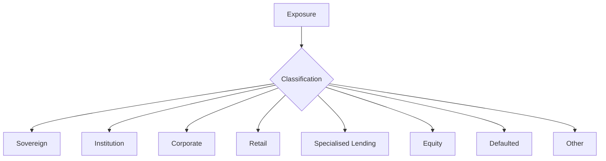
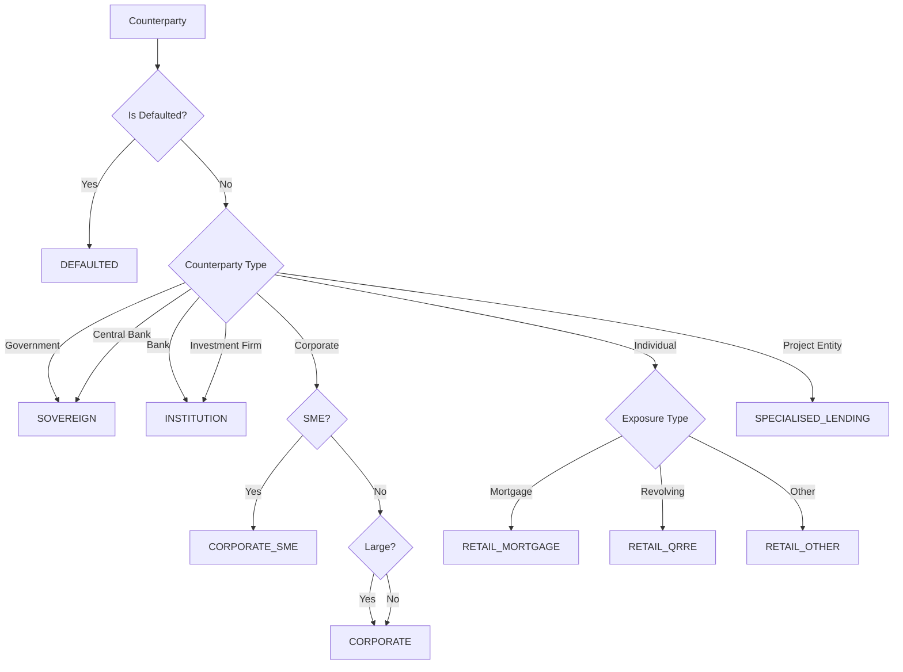

# Exposure Classes

Exposures are classified into regulatory categories that determine their treatment under the Standardised Approach (SA) and eligibility for Internal Ratings-Based (IRB) approaches.

## Overview



## Exposure Class Summary

| Class | Description | SA | F-IRB | A-IRB | Slotting |
|-------|-------------|:--:|:-----:|:-----:|:--------:|
| [**Sovereign**](sovereign.md) | Governments and central banks | :white_check_mark: | :white_check_mark: | :white_check_mark: | |
| [**Institution**](institution.md) | Banks and investment firms | :white_check_mark: | :white_check_mark: | :white_check_mark:* | |
| [**Corporate**](corporate.md) | Non-financial companies | :white_check_mark: | :white_check_mark: | :white_check_mark:* | |
| **Corporate SME** | Small/medium enterprises | :white_check_mark: | :white_check_mark: | :white_check_mark: | |
| [**Retail**](retail.md) | Individuals and small businesses | :white_check_mark: | | :white_check_mark: | |
| **Retail Mortgage** | Residential mortgages | :white_check_mark: | | :white_check_mark: | |
| **Retail QRRE** | Qualifying revolving exposures | :white_check_mark: | | :white_check_mark: | |
| **Retail Other** | Other retail exposures | :white_check_mark: | | :white_check_mark: | |
| **Specialised Lending** | Project/object/commodity finance | :white_check_mark: | | | :white_check_mark: |
| [**Equity**](other.md) | Equity holdings | :white_check_mark: | :white_check_mark: | | |
| **Defaulted** | Non-performing exposures | :white_check_mark: | :white_check_mark: | :white_check_mark: | |
| [**Other**](other.md) | PSE, MDB, RGLA, etc. | :white_check_mark: | Varies | Varies | |

*Basel 3.1 restricts A-IRB for large corporates and institutions

## Classification Process

The classifier assigns exposure classes based on:

1. **Counterparty type** - Legal entity classification
2. **Product type** - Facility/loan characteristics
3. **Size** - Turnover, exposure amounts
4. **Performance status** - Default indicators

```python
from rwa_calc.engine.classifier import ExposureClassifier

classifier = ExposureClassifier()

# Classify exposures
result = classifier.classify(
    exposures=resolved_exposures,
    config=CalculationConfig.crr(date(2026, 12, 31))
)

# Each exposure now has exposure_class assigned
```

## Classification Hierarchy



## Key Classification Criteria

### SME Definition

An entity is classified as SME if:
- Annual turnover ≤ EUR 50m (GBP 44m), AND
- Total assets ≤ EUR 43m (GBP 37.84m)

### Retail Criteria

An exposure qualifies as retail if:
- To an individual or small business
- Part of a pool of similar exposures
- Total exposure to borrower ≤ EUR 1m (GBP 880k)

### QRRE Criteria

Qualifying Revolving Retail Exposures:
- Revolving, unsecured
- To individuals
- Maximum line ≤ EUR 100k
- Unconditionally cancellable

### Specialised Lending

Project/object/commodity finance where:
- Repayment from asset cash flows
- Lender has substantial control
- Primary security is the financed asset

## Default Indicators

An exposure is classified as defaulted if:
- Past due > 90 days on material amount
- Unlikely to pay in full
- Subject to distressed restructuring
- Bankruptcy/insolvency proceedings
- Non-accrual status

```python
# Default check
if (days_past_due > 90 and past_due_amount > materiality_threshold) or
   unlikely_to_pay or
   distressed_restructuring:
    exposure_class = ExposureClass.DEFAULTED
```

## Treatment by Class

### Capital Calculation

| Class | SA Risk Weight Range | IRB Availability |
|-------|---------------------|------------------|
| Sovereign | 0% - 150% | F-IRB, A-IRB |
| Institution | 20% - 150% | F-IRB, A-IRB* |
| Corporate | 20% - 150% | F-IRB, A-IRB* |
| Corporate SME | 20% - 150% (+ factor) | F-IRB, A-IRB |
| Retail | 35% - 75% | A-IRB only |
| Specialised Lending | 70% - 250% | Slotting |
| Equity | 100% - 400% | Simple/PD/LGD |
| Defaulted | 100% - 150% | IRB (100% PD) |

### CRM Eligibility

| Class | Financial Collateral | Physical Collateral | Guarantees |
|-------|:--------------------:|:-------------------:|:----------:|
| Sovereign | :white_check_mark: | :white_check_mark: | :white_check_mark: |
| Institution | :white_check_mark: | :white_check_mark: | :white_check_mark: |
| Corporate | :white_check_mark: | :white_check_mark: | :white_check_mark: |
| Retail | :white_check_mark: | :white_check_mark: | Limited |
| Specialised Lending | :white_check_mark: | :white_check_mark: | :white_check_mark: |

### Supporting Factor Eligibility

| Class | SME Factor (CRR) | Infrastructure Factor (CRR) |
|-------|:----------------:|:---------------------------:|
| Corporate SME | :white_check_mark: | |
| Retail (SME) | :white_check_mark: | |
| Specialised Lending (Infra) | | :white_check_mark: |
| Other | | |

## Implementation

### Exposure Class Enum

```python
from rwa_calc.domain.enums import ExposureClass

# Available classes
ExposureClass.SOVEREIGN
ExposureClass.INSTITUTION
ExposureClass.CORPORATE
ExposureClass.CORPORATE_SME
ExposureClass.RETAIL_MORTGAGE
ExposureClass.RETAIL_QRRE
ExposureClass.RETAIL_OTHER
ExposureClass.SPECIALISED_LENDING
ExposureClass.EQUITY
ExposureClass.DEFAULTED
ExposureClass.PSE
ExposureClass.MDB
ExposureClass.RGLA
ExposureClass.OTHER
```

### Classification Configuration

```python
from rwa_calc.contracts.config import CalculationConfig

config = CalculationConfig.crr(
    reporting_date=date(2026, 12, 31),
    # Thresholds converted from EUR
    eur_gbp_rate=Decimal("0.88")
)

# SME threshold: EUR 50m → GBP 44m
# Retail threshold: EUR 1m → GBP 880k
```

## Detailed Documentation

- [**Sovereign**](sovereign.md) - Government and central bank exposures
- [**Institution**](institution.md) - Bank and investment firm exposures
- [**Corporate**](corporate.md) - Corporate and SME exposures
- [**Retail**](retail.md) - Retail mortgage, QRRE, and other retail
- [**Other Classes**](other.md) - Equity, PSE, MDB, and defaulted exposures
