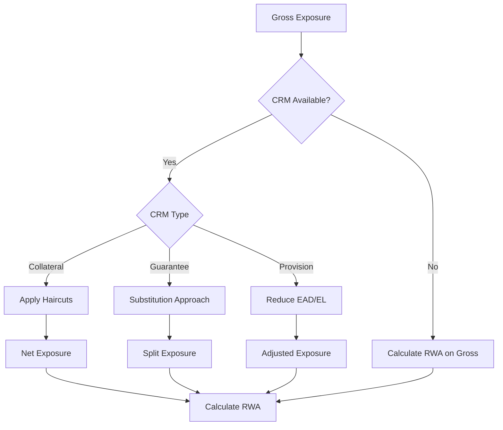
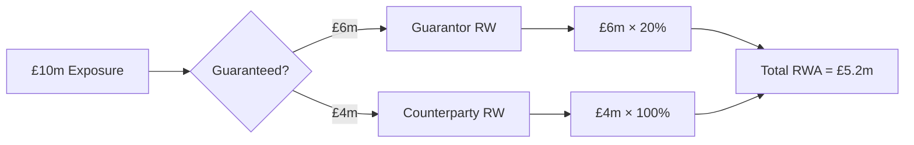

# Credit Risk Mitigation

**Credit Risk Mitigation (CRM)** techniques reduce the capital requirement for exposures by providing protection against default losses. The calculator supports collateral, guarantees, and provisions.

## Overview



## Collateral

### Financial Collateral

Financial collateral (cash, bonds, equity) directly reduces exposure.

#### Simple Method (SA Only)

The collateral's risk weight substitutes for the exposure's risk weight:

```python
# Protected portion uses collateral issuer's RW
RWA_protected = Protected_Amount × Collateral_RW

# Unprotected portion uses counterparty RW
RWA_unprotected = Unprotected_Amount × Counterparty_RW

# Total
RWA = RWA_protected + RWA_unprotected
```

#### Comprehensive Method

Applies haircuts to both exposure and collateral:

```python
# Exposure with volatility adjustment
E_adjusted = E × (1 + H_e)

# Collateral with haircuts
C_adjusted = C × (1 - H_c - H_fx)

# Net exposure
E_star = max(0, E_adjusted - C_adjusted)

# RWA on net exposure
RWA = E_star × Risk_Weight
```

### Supervisory Haircuts

| Collateral Type | Residual Maturity | Haircut (H_c) |
|-----------------|-------------------|---------------|
| **Cash** | Any | 0% |
| **Government/PSE CQS1** | ≤1 year | 0.5% |
| | 1-5 years | 2% |
| | >5 years | 4% |
| **Government/PSE CQS2-3** | ≤1 year | 1% |
| | 1-5 years | 3% |
| | >5 years | 6% |
| **Corporate CQS1-2** | ≤1 year | 1% |
| | 1-5 years | 4% |
| | >5 years | 8% |
| **Corporate CQS3** | ≤1 year | 2% |
| | 1-5 years | 6% |
| | >5 years | 12% |
| **Main Index Equity** | Any | 15% |
| **Other Listed Equity** | Any | 25% |
| **Gold** | Any | 15% |

**Currency Mismatch (H_fx):**
```python
# Add 8% if collateral currency ≠ exposure currency
if collateral_currency != exposure_currency:
    H_fx = 0.08
else:
    H_fx = 0.00
```

### Exposure Haircut (H_e)

For repos and similar transactions:

| Exposure Type | Haircut (H_e) |
|---------------|---------------|
| Government bonds CQS1 | Same as H_c table |
| Corporate bonds | Same as H_c table |
| Equity | 0% (exposure side) |

### Collateral Calculation Example

**Exposure:**
- Corporate loan, £10m
- Counterparty RW: 100%

**Collateral:**
- Government bonds (CQS1), £8m
- Residual maturity: 3 years
- Same currency

**Calculation (Comprehensive Method):**
```python
# Haircuts
H_e = 0%  # Loan exposure
H_c = 2%  # Govt bond 1-5yr
H_fx = 0%  # Same currency

# Adjusted values
E_adjusted = 10,000,000 × (1 + 0.00) = 10,000,000
C_adjusted = 8,000,000 × (1 - 0.02 - 0.00) = 7,840,000

# Net exposure
E_star = max(0, 10,000,000 - 7,840,000) = 2,160,000

# RWA
RWA = 2,160,000 × 100% = £2,160,000

# vs. Gross RWA
Gross_RWA = 10,000,000 × 100% = £10,000,000

# Benefit: 78.4% reduction
```

### Physical Collateral

Physical collateral (real estate, equipment) provides CRM for IRB:

| Collateral Type | F-IRB LGD |
|-----------------|-----------|
| Residential Real Estate | 35% |
| Commercial Real Estate | 35% |
| Receivables | 35% |
| Other Physical | 40% |
| Unsecured | 45% |

**Eligibility Requirements:**
- Legal certainty of enforcement
- Regular revaluation
- Proper documentation
- Insurance where appropriate

## Guarantees

### Substitution Approach

The guaranteed portion is treated as an exposure to the guarantor:



### Eligible Guarantors

| Guarantor Type | Eligibility |
|----------------|-------------|
| Sovereigns | CQS1-3 |
| Institutions | CQS1-3 |
| Corporates | Rated corporates with lower RW |
| Parent Companies | Under certain conditions |

### Guarantee Requirements

1. **Direct claim** on guarantor
2. **Unconditional** - no conditions to payment
3. **Irrevocable** - cannot be cancelled
4. **Legally enforceable** in relevant jurisdictions

### Double Default (CRR)

For qualifying guarantees, the double default treatment may apply:

```python
# Probability both obligor AND guarantor default
PD_joint = PD_obligor × PD_guarantor × (1 + correlation)

# Typically results in lower RWA
```

### Guarantee Example

**Exposure:**
- SME loan, £5m
- Counterparty RW: 100%

**Guarantee:**
- UK Government (0% RW)
- Guaranteed amount: £4m

**Calculation:**
```python
# Guaranteed portion (G10 sovereign)
RWA_guaranteed = 4,000,000 × 0% = £0

# Unguaranteed portion
RWA_unguaranteed = 1,000,000 × 100% = £1,000,000

# Total RWA
RWA = £0 + £1,000,000 = £1,000,000

# vs. Gross RWA
Gross_RWA = £5,000,000

# Benefit: 80% reduction
```

### Maturity Mismatch

When protection maturity < exposure maturity:

```python
# Minimum protection maturity: 1 year
t = max(0.25, protection_residual_maturity)
T = max(0.25, exposure_residual_maturity)

# Adjustment factor
if t >= T:
    adjustment = 1.0
else:
    adjustment = (t - 0.25) / (T - 0.25)

# Adjusted protection
Adjusted_Protection = Protection × adjustment
```

**Example:**
- Exposure maturity: 5 years
- Guarantee maturity: 3 years

```python
adjustment = (3 - 0.25) / (5 - 0.25) = 2.75 / 4.75 = 0.579

# £4m guarantee provides £2.32m effective protection
```

## Provisions

### SA Treatment

Specific provisions reduce EAD:

```python
EAD = Gross_Exposure - Specific_Provision
RWA = EAD × Risk_Weight
```

### IRB Treatment

Provisions compare to Expected Loss:

```python
EL = PD × LGD × EAD

if Provisions >= EL:
    # Excess provisions can be added to Tier 2 (limited)
    Excess = Provisions - EL
else:
    # Shortfall deducted from CET1
    Shortfall = EL - Provisions
```

### SCRA and GCRA Provisions

| Type | Description | Treatment |
|------|-------------|-----------|
| **SCRA** | Specific Credit Risk Adjustments | Reduce EAD directly |
| **GCRA** | General Credit Risk Adjustments | May be included in Tier 2 |

### Provision Allocation

Provisions can be allocated at different levels:

| Level | Application |
|-------|-------------|
| Counterparty | Applies to all exposures |
| Facility | Applies to facility and sub-loans |
| Loan | Applies to specific loan |

## CRM Hierarchy

When multiple CRM types are available:

```python
# Order of application
1. Apply specific provisions (reduce EAD)
2. Apply collateral (reduce net exposure)
3. Apply guarantees (substitution on remainder)
```

### Example with Multiple CRM

**Exposure:**
- Corporate loan, £10m
- Counterparty RW: 100%

**CRM:**
- Specific provision: £1m
- Cash collateral: £3m
- Bank guarantee (20% RW): £4m

**Calculation:**
```python
# Step 1: Apply provision
Net_1 = 10,000,000 - 1,000,000 = 9,000,000

# Step 2: Apply collateral (no haircut for cash)
Net_2 = 9,000,000 - 3,000,000 = 6,000,000

# Step 3: Apply guarantee (substitution)
Guaranteed = min(4,000,000, 6,000,000) = 4,000,000
Unguaranteed = 6,000,000 - 4,000,000 = 2,000,000

# Calculate RWA
RWA_guaranteed = 4,000,000 × 20% = 800,000
RWA_unguaranteed = 2,000,000 × 100% = 2,000,000

Total_RWA = £2,800,000

# vs. Gross RWA = £10,000,000
# Benefit: 72% reduction
```

## Implementation

### CRM Processor

```python
from rwa_calc.engine.crm.processor import CRMProcessor
from rwa_calc.contracts.config import CalculationConfig

# Create processor
processor = CRMProcessor()

# Process exposures
result = processor.process(
    exposures=classified_exposures,
    collateral=collateral_data,
    guarantees=guarantee_data,
    provisions=provision_data,
    config=CalculationConfig.crr(reporting_date=date(2026, 12, 31))
)

# Access adjusted exposures
adjusted = result.adjusted_exposures
```

### Haircut Lookup

```python
from rwa_calc.data.tables.crr_haircuts import get_haircut

haircut = get_haircut(
    collateral_type=CollateralType.GOVERNMENT_BOND,
    cqs=CQS.CQS_1,
    residual_maturity_years=3
)
# Returns: 0.02 (2%)
```

## CRM Data Structure

The calculator accepts CRM data at multiple levels:

```python
# Collateral data
collateral = {
    "collateral_id": "COL001",
    "counterparty_id": "CP001",  # Or facility_id, loan_id
    "collateral_type": "CASH",
    "value": 1_000_000,
    "currency": "GBP",
    "issuer_cqs": None,  # For bonds
    "residual_maturity": None  # For bonds
}

# Guarantee data
guarantee = {
    "guarantee_id": "GAR001",
    "counterparty_id": "CP001",  # Protected party
    "guarantor_id": "GP001",
    "amount": 5_000_000,
    "guarantor_type": "SOVEREIGN",
    "guarantor_cqs": 1,
    "maturity_date": date(2028, 12, 31)
}

# Provision data
provision = {
    "provision_id": "PRV001",
    "counterparty_id": "CP001",  # Or facility_id, loan_id
    "provision_type": "SCRA",
    "amount": 500_000,
    "ifrs_stage": "STAGE_3"
}
```

## Regulatory References

| Topic | CRR Article | BCBS CRE |
|-------|-------------|----------|
| CRM overview | Art. 192-194 | CRE22.1-10 |
| Financial collateral | Art. 197-200 | CRE22.35-70 |
| Haircuts | Art. 224-227 | CRE22.50-55 |
| Guarantees | Art. 213-216 | CRE22.71-85 |
| Maturity mismatch | Art. 238-239 | CRE22.90-95 |
| Physical collateral | Art. 199 | CRE22.100-120 |

## Next Steps

- [Supporting Factors](supporting-factors.md) - SME and infrastructure factors
- [Standardised Approach](standardised-approach.md) - SA with CRM
- [IRB Approach](irb-approach.md) - IRB with CRM
