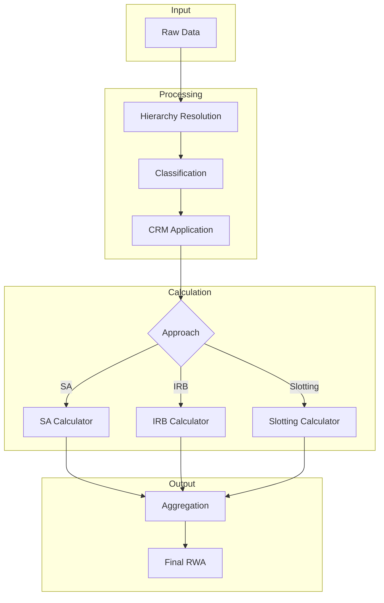
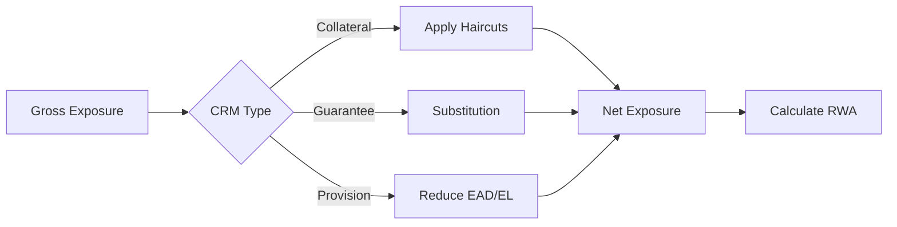

# Calculation Methodology

This section explains how Risk-Weighted Assets (RWA) are calculated for credit risk exposures. Understanding these methodologies is essential for auditing results and validating regulatory compliance.

## RWA Calculation Overview

Risk-Weighted Assets represent the risk-adjusted value of exposures, used to determine capital requirements:

```
Capital Requirement = RWA × Capital Ratio (typically 8%)
```

The calculator supports four main approaches:

| Approach | Description | Applicable To |
|----------|-------------|---------------|
| [**Standardised (SA)**](standardised-approach.md) | Regulatory risk weights | All exposure classes |
| [**IRB**](irb-approach.md) | Internal ratings-based | Approved portfolios |
| [**Slotting**](specialised-lending.md) | Category-based weights | Specialised lending |
| [**Equity**](equity.md) | Dedicated equity treatment | Equity holdings |

## Calculation Pipeline



## Key Formulas

### Standardised Approach

```
RWA = EAD × Risk Weight × Supporting Factors
```

Where:
- **EAD** = Exposure at Default (drawn + CCF × undrawn)
- **Risk Weight** = Regulatory-prescribed weight based on rating/class
- **Supporting Factors** = SME/infrastructure factors (CRR only)

### IRB Approach

```
RWA = K × 12.5 × EAD × MA × Scaling Factor
```

Where:
- **K** = Capital requirement from IRB formula
- **12.5** = Reciprocal of 8% minimum capital ratio
- **EAD** = Exposure at Default
- **MA** = Maturity Adjustment
- **Scaling Factor** = 1.06 (CRR) or 1.0 (Basel 3.1)

### Slotting Approach

```
RWA = EAD × Slotting Risk Weight
```

Where:
- **Slotting Risk Weight** = Based on category (Strong/Good/Satisfactory/Weak)

## Calculation Components

### Exposure at Default (EAD)

EAD is the expected exposure amount at the time of default:

| Exposure Type | EAD Calculation |
|---------------|-----------------|
| On-Balance Sheet | Gross carrying amount |
| Off-Balance Sheet | Committed × CCF |
| Derivatives | Mark-to-market + Add-on |

### Credit Conversion Factors (CCF)

CCFs convert off-balance sheet exposures to EAD:

| Item Type | CCF |
|-----------|-----|
| Unconditionally Cancellable | 0% (CRR) / 10% (Basel 3.1) |
| Short-term Trade Finance | 20% |
| Undrawn Commitments | 20-50% |
| Direct Credit Substitutes | 100% |

### Risk Weights

Risk weights depend on:
1. **Exposure class** (Central Govt / Central Bank, Institution, Corporate, Retail, etc.)
2. **Credit quality** (CQS 1-6 or internal rating)
3. **Collateral** (secured vs unsecured)
4. **Maturity** (for certain exposures)

### Credit Risk Mitigation (CRM)

CRM reduces exposure or substitutes risk weight:



See [Credit Risk Mitigation](crm.md) for details.

## Approach Selection

The calculation approach is determined by:

1. **Regulatory approval** - IRB requires PRA approval
2. **Exposure class** - Some classes have restricted approaches
3. **Data availability** - IRB requires PD estimates

| Exposure Class | SA | F-IRB | A-IRB | Slotting |
|----------------|:--:|:-----:|:-----:|:--------:|
| Central Govt / Central Bank | :white_check_mark: | :white_check_mark: | :white_check_mark: | |
| Institution | :white_check_mark: | :white_check_mark: | :white_check_mark:* | |
| Corporate | :white_check_mark: | :white_check_mark: | :white_check_mark:* | |
| Retail | :white_check_mark: | | :white_check_mark: | |
| Specialised Lending | :white_check_mark: | | | :white_check_mark: |
| Equity | :white_check_mark: | :white_check_mark: | | |

*Basel 3.1 restricts A-IRB for banks and large corporates

## Framework Adjustments

### CRR Adjustments

1. **1.06 Scaling Factor**: Applied to all IRB RWA
2. **SME Supporting Factor**: 0.7619/0.85 tiered reduction
3. **Infrastructure Factor**: 0.75 flat reduction

### Basel 3.1 Adjustments

1. **Output Floor**: max(IRB RWA, 72.5% × SA RWA)
2. **PD Floors**: Differentiated by exposure class
3. **LGD Floors**: For A-IRB by collateral type

## Validation and Audit

### Traceability

Every calculation can be traced:
- Input values for each exposure
- Intermediate calculations
- Applied adjustments
- Final RWA

### Error Accumulation

The calculator accumulates errors without failing:
```python
result = pipeline.run(config)

for error in result.errors:
    print(f"{error.exposure_id}: {error.message}")
```

### Reconciliation Points

Key reconciliation points:
1. **EAD Total** - Sum of all exposures at default
2. **RWA by Approach** - SA + IRB + Slotting
3. **RWA by Exposure Class** - Sum by classification
4. **Floor Impact** - IRB before and after floor (Basel 3.1)

## Detailed Methodology

Explore each calculation approach in detail:

- [**Standardised Approach**](standardised-approach.md) - SA methodology and risk weights
- [**IRB Approach**](irb-approach.md) - F-IRB and A-IRB formulas
- [**Specialised Lending**](specialised-lending.md) - Slotting approach
- [**Equity**](equity.md) - Equity exposure treatment
- [**Credit Risk Mitigation**](crm.md) - CRM techniques
- [**Supporting Factors**](supporting-factors.md) - SME and infrastructure factors
- [**FX Conversion**](fx-conversion.md) - Multi-currency portfolio support
