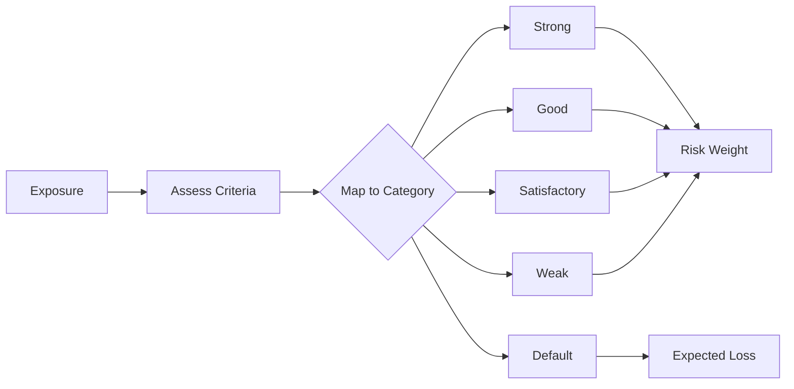

# Specialised Lending

**Specialised Lending** exposures are those where repayment depends primarily on the cash flows generated by the financed assets rather than the independent capacity of the borrower. These exposures receive special treatment under both SA and IRB frameworks.

## Overview

Specialised lending categories:

| Category | Abbreviation | Description |
|----------|--------------|-------------|
| Project Finance | PF | Financing of large, complex projects |
| Object Finance | OF | Financing of physical assets (ships, aircraft) |
| Commodities Finance | CF | Structured financing of commodities |
| Income-Producing Real Estate | IPRE | Real estate with rental/sale income |
| High Volatility Commercial Real Estate | HVCRE | Speculative CRE development |

## Slotting Approach

The **Slotting Approach** maps exposures to supervisory categories based on qualitative criteria, rather than estimating PD:



## Slotting Categories

### Assessment Criteria

Each exposure is assessed against supervisory criteria:

| Factor | Strong | Good | Satisfactory | Weak |
|--------|--------|------|--------------|------|
| **Financial strength** | Excellent | Good | Acceptable | Deteriorating |
| **Political/legal** | Very low | Low | Acceptable | High |
| **Transaction characteristics** | Very favorable | Favorable | Acceptable | Unfavorable |
| **Asset strength** | Very strong | Strong | Adequate | Weak |
| **Sponsor strength** | Excellent | Good | Adequate | Weak |

### Project Finance Criteria

| Factor | Strong | Good | Satisfactory | Weak |
|--------|--------|------|--------------|------|
| Market conditions | Few competing suppliers | Few suppliers, demand stable | Average | Weak or declining |
| Financial ratios | Strong coverage | Good coverage | Adequate | Weak |
| Stress resilience | Robust | Good | Limited | Poor |
| Contractual arrangements | Strong contracts | Acceptable | Some weaknesses | Significant gaps |
| Reserve accounts | Comprehensive | Adequate | Minimum | Insufficient |

### IPRE Criteria

| Factor | Strong | Good | Satisfactory | Weak |
|--------|--------|------|--------------|------|
| LTV | <60% | 60-75% | 75-85% | >85% |
| DSCR | >1.35x | 1.2-1.35x | 1.0-1.2x | <1.0x |
| Location | Prime | Good | Acceptable | Weak |
| Tenant quality | Strong | Adequate | Variable | Poor |
| Lease length | Long-term | Medium-term | Short-term | Month-to-month |

## Risk Weights

### CRR Risk Weights

| Category | Strong | Good | Satisfactory | Weak | Default |
|----------|--------|------|--------------|------|---------|
| Project Finance | 70% | 90% | 115% | 250% | 0%* |
| Object Finance | 70% | 90% | 115% | 250% | 0%* |
| Commodities Finance | 70% | 90% | 115% | 250% | 0%* |
| IPRE | 70% | 90% | 115% | 250% | 0%* |
| HVCRE | 95% | 120% | 140% | 250% | 0%* |

*Default exposures: 0% RW with 50% EL deduction

### Basel 3.1 Risk Weights

| Category | Strong | Good | Satisfactory | Weak | Default |
|----------|--------|------|--------------|------|---------|
| PF (Pre-Operational) | **80%** | **100%** | **120%** | **350%** | 0%* |
| PF (Operational) | 70% | 90% | 115% | 250% | 0%* |
| Object Finance | 70% | 90% | 115% | 250% | 0%* |
| Commodities Finance | 70% | 90% | 115% | 250% | 0%* |
| IPRE | 70% | 90% | 115% | 250% | 0%* |
| HVCRE | 95% | 120% | 140% | 250% | 0%* |

!!! note "Basel 3.1 Project Finance Changes"
    Pre-operational project finance receives higher risk weights under Basel 3.1:
    - Strong: 70% → 80%
    - Good: 90% → 100%
    - Satisfactory: 115% → 120%
    - Weak: 250% → 350%

## Expected Loss for Default

For defaulted exposures (50% EL assumption):

```python
# Instead of RWA
EL_deduction = EAD × 50%

# This is deducted from capital directly
```

## Calculation Example

**Exposure:**
- IPRE loan, £20m
- LTV: 65%
- DSCR: 1.25x
- Prime location
- Strong tenant
- Category assessment: **Good**

**CRR Calculation:**
```python
# Category: Good
Risk_Weight = 90%

# RWA
RWA = EAD × Risk_Weight
RWA = £20,000,000 × 90%
RWA = £18,000,000
```

**Basel 3.1 Calculation:**
```python
# Same category and weight
RWA = £18,000,000

# Check output floor
SA_equivalent_RW = 70%  # IPRE LTV 60-75%
SA_RWA = £20,000,000 × 70% = £14,000,000
Floor = £14,000,000 × 72.5% = £10,150,000

# Slotting RWA > Floor, so no adjustment
Final_RWA = £18,000,000
```

## SA Alternative

Specialised lending can also be treated under SA:

| Type | SA Treatment |
|------|--------------|
| Project Finance | Corporate risk weights |
| Object Finance | Corporate risk weights |
| Commodities Finance | Corporate risk weights |
| IPRE | CRE risk weights |
| HVCRE | CRE risk weights |

**When to use SA vs Slotting:**

| Use SA when | Use Slotting when |
|-------------|-------------------|
| External rating available | No PD estimate available |
| IRB not approved | IRB approved for portfolio |
| Lower SA RW expected | Specialized assessment needed |

## Implementation

### Slotting Calculator

```python
from rwa_calc.engine.slotting.calculator import SlottingCalculator
from rwa_calc.contracts.config import CalculationConfig

# Create calculator
calculator = SlottingCalculator()

# Calculate
result = calculator.calculate(
    exposures=specialised_lending_exposures,
    config=CalculationConfig.crr(reporting_date=date(2026, 12, 31))
)

print(f"Slotting RWA: {result.total_rwa:,.2f}")
```

### Category Mapping

```python
from rwa_calc.data.tables.crr_slotting import get_slotting_risk_weight
from rwa_calc.domain.enums import SlottingCategory, SpecialisedLendingType

# Lookup risk weight
rw = get_slotting_risk_weight(
    lending_type=SpecialisedLendingType.IPRE,
    category=SlottingCategory.GOOD
)
# Returns: 0.90 (90%)
```

## Project Finance Detail

### Pre-Operational Phase

Project is in construction or commissioning:
- Construction risk present
- Cash flows not yet established
- Higher risk weights under Basel 3.1

### Operational Phase

Project is generating cash flows:
- Construction complete
- Revenue stream established
- Standard slotting weights apply

### Phase Transition

```python
if project.construction_complete and project.generating_cashflows:
    phase = "operational"
else:
    phase = "pre_operational"

# Basel 3.1 applies different weights
if framework == "BASEL_3_1" and lending_type == "PROJECT_FINANCE":
    if phase == "pre_operational":
        # Use higher pre-op weights
        weights = {"strong": 0.80, "good": 1.00, "satisfactory": 1.20, "weak": 3.50}
    else:
        # Use standard weights
        weights = {"strong": 0.70, "good": 0.90, "satisfactory": 1.15, "weak": 2.50}
```

## HVCRE Treatment

**High Volatility Commercial Real Estate** receives higher risk weights due to:
- Speculative development
- No established cash flows
- Higher correlation to economic cycles

**HVCRE Criteria:**
- CRE development or land acquisition
- Repayment from future sale or refinancing
- Uncertain outcome

**Risk Weights:**

| Category | Standard SL | HVCRE |
|----------|-------------|-------|
| Strong | 70% | 95% |
| Good | 90% | 120% |
| Satisfactory | 115% | 140% |
| Weak | 250% | 250% |

## Supporting Factors

### Infrastructure Factor (CRR Only)

Qualifying infrastructure project finance receives 0.75 factor:

```python
# Eligibility
if (lending_type == "PROJECT_FINANCE" and
    is_qualifying_infrastructure and
    framework == "CRR"):

    RWA = RWA × 0.75
```

**Qualifying criteria:**
- Infrastructure project entity
- Revenue in EUR/GBP or hedged
- Contractual arrangements limit risk
- Stable cash flow structure

!!! warning "Basel 3.1"
    Infrastructure factor is **removed** under Basel 3.1.

## Regulatory References

| Topic | CRR Article | BCBS CRE |
|-------|-------------|----------|
| Specialised lending definition | Art. 147(8) | CRE33.1 |
| Slotting categories | Art. 153(5) | CRE33.2 |
| Risk weights | Art. 153(5) | CRE33.3-4 |
| HVCRE | Art. 153(5) | CRE33.5 |
| Infrastructure factor | Art. 501a | N/A |

## Next Steps

- [Credit Risk Mitigation](crm.md) - CRM for specialised lending
- [Supporting Factors](supporting-factors.md) - Infrastructure factor details
- [Configuration](../configuration.md) - Slotting configuration
