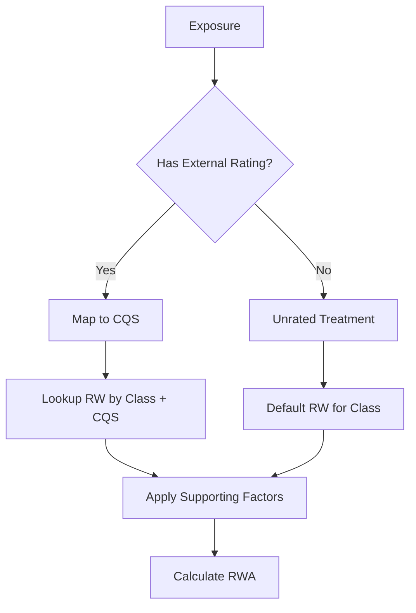

# Standardised Approach

The **Standardised Approach (SA)** uses regulatory-prescribed risk weights based on external credit ratings and exposure characteristics. It is the default approach for institutions without IRB approval.

## Overview

```
RWA = EAD × Risk Weight × Supporting Factors
```

The SA calculation involves:
1. Determining the **Exposure Class**
2. Mapping to a **Credit Quality Step (CQS)** if rated
3. Looking up the **Risk Weight**
4. Applying **Supporting Factors** (CRR only)

## Risk Weight Determination



## Credit Quality Steps (CQS)

External ratings are mapped to Credit Quality Steps:

| CQS | S&P/Fitch | Moody's | Description |
|-----|-----------|---------|-------------|
| CQS 1 | AAA to AA- | Aaa to Aa3 | Prime/High Grade |
| CQS 2 | A+ to A- | A1 to A3 | Upper Medium Grade |
| CQS 3 | BBB+ to BBB- | Baa1 to Baa3 | Lower Medium Grade |
| CQS 4 | BB+ to BB- | Ba1 to Ba3 | Non-Investment Grade |
| CQS 5 | B+ to B- | B1 to B3 | Highly Speculative |
| CQS 6 | CCC+ and below | Caa1 and below | Substantial Risk |

## Risk Weights by Exposure Class

### Sovereign Exposures

Exposures to governments and central banks:

| CQS | Risk Weight |
|-----|-------------|
| CQS 1 | 0% |
| CQS 2 | 20% |
| CQS 3 | 50% |
| CQS 4 | 100% |
| CQS 5 | 100% |
| CQS 6 | 150% |
| Unrated | 100% |

!!! note "UK Government"
    UK Government (HM Treasury) exposures receive 0% risk weight as a CQS 1 sovereign.

### Institution Exposures

Exposures to banks and investment firms:

| CQS | CRR Risk Weight | Basel 3.1 (ECRA) |
|-----|-----------------|------------------|
| CQS 1 | 20% | 20% |
| CQS 2 | 30%* | 30% |
| CQS 3 | 50% | 50% |
| CQS 4 | 100% | 100% |
| CQS 5 | 100% | 100% |
| CQS 6 | 150% | 150% |

*UK deviation from standard 50% Basel weight

**Unrated Institutions:**
- CRR: Apply due diligence assessment
- Basel 3.1: Use Standardised Credit Risk Assessment (SCRA)

### Corporate Exposures

Exposures to non-financial corporates:

| CQS | CRR | Basel 3.1 |
|-----|-----|-----------|
| CQS 1 | 20% | 20% |
| CQS 2 | 50% | 50% |
| CQS 3 | 75% | 75% |
| CQS 4 | 100% | 100% |
| CQS 5 | 150% | 100% |
| CQS 6 | 150% | 150% |
| Unrated | 100% | 100% |

**Corporate SME:**
- Same risk weights as Corporate
- SME Supporting Factor may apply (CRR only)

### Retail Exposures

**Residential Mortgages (CRR):**

| Criterion | Risk Weight |
|-----------|-------------|
| LTV ≤ 80%, performing | 35% |
| LTV > 80% or other | 75% |

**Residential Mortgages (Basel 3.1):**

| LTV | Whole Loan | Income-Producing |
|-----|------------|------------------|
| ≤ 50% | 20% | 30% |
| 50-60% | 25% | 35% |
| 60-70% | 30% | 45% |
| 70-80% | 40% | 60% |
| 80-90% | 50% | 75% |
| 90-100% | 70% | 105% |
| > 100% | Cpty RW | Cpty RW |

**QRRE (Qualifying Revolving Retail Exposures):**

| Framework | Risk Weight |
|-----------|-------------|
| CRR | 75% |
| Basel 3.1 | 45-75% (depends on transactor status) |

**Other Retail:**

| Framework | Risk Weight |
|-----------|-------------|
| CRR | 75% |
| Basel 3.1 | 75% |

### Defaulted Exposures

Exposures where the counterparty is in default:

| Provision Coverage | CRR | Basel 3.1 |
|--------------------|-----|-----------|
| < 20% | 150% | 150% |
| 20-50% | 100% | 100% |
| ≥ 50% | 100% | 50-100% |

### Equity Exposures

| Type | CRR | Basel 3.1 |
|------|-----|-----------|
| Exchange-traded | 100% | 100% |
| Other equity | 150% | 250% |
| Private equity | 150% | 400% |

### Commercial Real Estate

| Scenario | CRR | Basel 3.1 |
|----------|-----|-----------|
| Standard | 100% | 100% |
| Income-Producing (LTV ≤ 60%) | 100% | 70% |
| Income-Producing (LTV > 60%) | 100% | 110% |

## EAD Calculation

### On-Balance Sheet

```python
EAD = Gross_Carrying_Amount - Specific_Provisions
```

### Off-Balance Sheet

```python
EAD = Committed_Amount × CCF
```

**Credit Conversion Factors by Risk Type (CRR Art. 111):**

The `risk_type` column determines the CCF for off-balance sheet exposures:

| Risk Type | Code | SA CCF | Description |
|-----------|------|--------|-------------|
| Full Risk | FR | 100% | Guarantees, acceptances, credit derivatives |
| Medium Risk | MR | 50% | NIFs, RUFs, standby LCs, committed undrawn |
| Medium-Low Risk | MLR | 20% | Documentary credits, short-term trade finance |
| Low Risk | LR | 0% | Unconditionally cancellable commitments |

**Basel 3.1 Changes:**

| Item Type | CRR CCF | Basel 3.1 CCF |
|-----------|---------|---------------|
| Unconditionally Cancellable | 0% | 10% |
| Trade Finance (ST) | 20% | 20% |
| Undrawn Commitments (<1yr) | 20% | 40% |
| Undrawn Commitments (≥1yr) | 50% | 40% |
| NIFs/RUFs | 50% | 50% |
| Direct Credit Substitutes | 100% | 100% |

## Credit Risk Mitigation

SA allows several CRM techniques:

### Financial Collateral Simple Method

```python
# Reduce RW based on collateral
Collateral_RW = Risk_Weight_of_Collateral_Issuer

# Apply lower of exposure RW or collateral RW
Effective_RW = min(Exposure_RW, Collateral_RW)
```

### Financial Collateral Comprehensive Method

```python
# Calculate adjusted values
E_adjusted = Exposure × (1 + H_e)  # Exposure haircut
C_adjusted = Collateral × (1 - H_c - H_fx)  # Collateral haircut

# Net exposure
E_star = max(0, E_adjusted - C_adjusted)

# RWA on net exposure
RWA = E_star × Risk_Weight
```

**Supervisory Haircuts:**

| Collateral Type | Haircut |
|-----------------|---------|
| Cash (same currency) | 0% |
| Government bonds ≤1yr | 0.5% |
| Government bonds 1-5yr | 2% |
| Government bonds >5yr | 4% |
| Corporate bonds AAA-AA ≤1yr | 1% |
| Corporate bonds AAA-AA 1-5yr | 4% |
| Corporate bonds AAA-AA >5yr | 8% |
| Main index equity | 15% |
| Other equity | 25% |
| **Currency mismatch add-on** | **+8%** |

### Guarantees (Substitution Approach)

```python
# Guaranteed portion treated as exposure to guarantor
Guaranteed_RWA = Guaranteed_Amount × Guarantor_RW

# Unguaranteed portion at counterparty RW
Unguaranteed_RWA = (EAD - Guaranteed_Amount) × Counterparty_RW

# Total RWA
RWA = Guaranteed_RWA + Unguaranteed_RWA
```

## Supporting Factors (CRR Only)

### SME Supporting Factor

Reduces RWA for SME exposures:

```python
# Check eligibility
if turnover <= EUR_50m and is_sme:
    threshold = EUR_2.5m  # GBP 2.2m

    if exposure <= threshold:
        factor = 0.7619
    else:
        factor = (threshold * 0.7619 + (exposure - threshold) * 0.85) / exposure

    RWA = RWA * factor
```

### Infrastructure Factor

Reduces RWA for qualifying infrastructure:

```python
if is_qualifying_infrastructure:
    RWA = RWA * 0.75
```

## Calculation Example

**Exposure:**
- Corporate loan, £10m drawn
- Rated A+ (CQS 2)
- SME counterparty (turnover £30m)
- Unsecured

**Calculation:**
```python
# Step 1: EAD
EAD = £10,000,000

# Step 2: Risk Weight (CQS 2 Corporate)
RW = 50%

# Step 3: Base RWA
Base_RWA = £10,000,000 × 50% = £5,000,000

# Step 4: SME Factor (CRR only)
# Exposure > threshold, so tiered
threshold = £2,200,000
factor = (2,200,000 × 0.7619 + 7,800,000 × 0.85) / 10,000,000
factor = (1,676,180 + 6,630,000) / 10,000,000
factor = 0.831

# Step 5: Final RWA (CRR)
Final_RWA = £5,000,000 × 0.831 = £4,153,090

# Basel 3.1 (no SME factor)
Final_RWA_B31 = £5,000,000
```

## Implementation Notes

### Calculator Usage

```python
from rwa_calc.engine.sa.calculator import SACalculator
from rwa_calc.contracts.config import CalculationConfig

# Create SA calculator
calculator = SACalculator()

# Calculate RWA
result = calculator.calculate(
    exposures=classified_exposures,
    config=CalculationConfig.crr(reporting_date=date(2026, 12, 31))
)

# Access results
print(f"Total SA RWA: {result.total_rwa}")
```

### Risk Weight Lookup

```python
from rwa_calc.data.tables.crr_risk_weights import get_risk_weight

# Lookup risk weight
rw = get_risk_weight(
    exposure_class=ExposureClass.CORPORATE,
    cqs=CQS.CQS_2
)
# Returns: 0.50 (50%)
```

## Regulatory References

| Topic | CRR Article | BCBS CRE |
|-------|-------------|----------|
| Risk weight assignment | Art. 113-134 | CRE20-22 |
| CCFs | Art. 111 | CRE20.10 |
| CRM | Art. 192-241 | CRE22 |
| SME factor | Art. 501 | N/A |
| Real estate | Art. 124-125 | CRE20.70-90 |

## Next Steps

- [IRB Approach](irb-approach.md) - Internal ratings-based methodology
- [Credit Risk Mitigation](crm.md) - CRM techniques in detail
- [Supporting Factors](supporting-factors.md) - SME and infrastructure factors
