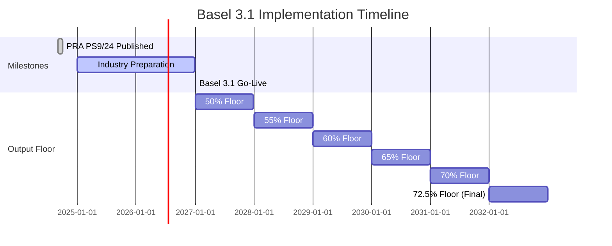

# Basel 3.1

**Basel 3.1** represents a significant overhaul of credit risk capital requirements, implemented in the UK through PRA PS9/24. It becomes effective on **1 January 2027**.

## Legal Basis

| Document | Reference |
|----------|-----------|
| Primary Policy | PRA PS9/24 (Near-Final Rules) |
| Consultation | PRA CP16/22 |
| Basel Standards | BCBS CRE20-CRE99 |

## Key Changes from CRR

### 1. Removal of 1.06 Scaling Factor

The 1.06 multiplier applied to all IRB RWA is removed:

=== "CRR"

    ```
    RWA = K × 12.5 × EAD × MA × 1.06
    ```

=== "Basel 3.1"

    ```
    RWA = K × 12.5 × EAD × MA
    ```

!!! info "Impact"
    This reduces IRB RWA by approximately 5.7% before other Basel 3.1 changes.

### 2. Output Floor

An **output floor** ensures IRB RWA cannot fall below **72.5%** of the equivalent SA RWA:

```
RWA_final = max(RWA_IRB, 0.725 × RWA_SA_equivalent)
```

**Transitional Phase-In:**

| Year | Floor Percentage |
|------|------------------|
| 2027 | 50% |
| 2028 | 55% |
| 2029 | 60% |
| 2030 | 65% |
| 2031 | 70% |
| 2032+ | 72.5% |

!!! warning "Impact"
    For exposures with significant IRB benefit (RWA_IRB < 72.5% × RWA_SA), this floor will increase capital requirements.

### 3. Removal of Supporting Factors

All CRR supporting factors are withdrawn:

| Factor | CRR | Basel 3.1 |
|--------|-----|-----------|
| SME Supporting Factor | 0.7619/0.85 | **Removed** |
| Infrastructure Factor | 0.75 | **Removed** |

### 4. Differentiated PD Floors

PD floors vary by exposure class instead of a uniform 0.03%:

| Exposure Class | CRR PD Floor | Basel 3.1 PD Floor |
|----------------|--------------|-------------------|
| Corporate | 0.03% | **0.05%** |
| Large Corporate | 0.03% | **0.05%** |
| Bank | 0.03% | **0.05%** |
| Retail Mortgage | 0.03% | **0.05%** |
| Retail QRRE (transactor) | 0.03% | 0.03% |
| Retail QRRE (revolver) | 0.03% | **0.10%** |
| Retail Other | 0.03% | **0.05%** |

### 5. A-IRB LGD Floors

New minimum LGD values for Advanced IRB:

| Collateral Type | LGD Floor |
|-----------------|-----------|
| Unsecured - Senior | 25% |
| Unsecured - Subordinated | 50% |
| Secured - Financial Collateral | 0% |
| Secured - Receivables | 15% |
| Secured - Commercial Real Estate | 15% |
| Secured - Residential Real Estate | 10% |
| Secured - Other Physical | 20% |

### 6. Revised SA Risk Weights

Standardised Approach risk weights are recalibrated:

#### Corporate Exposures

| CQS | CRR | Basel 3.1 |
|-----|-----|-----------|
| CQS 1 (AAA to AA-) | 20% | 20% |
| CQS 2 (A+ to A-) | 50% | 50% |
| CQS 3 (BBB+ to BBB-) | 75% | 75% |
| CQS 4 (BB+ to BB-) | 100% | 100% |
| CQS 5 (B+ to B-) | 150% | 100% |
| CQS 6 (CCC+/Below) | 150% | 150% |
| Unrated | 100% | 100% |

#### Real Estate Exposures

New LTV-based risk weights for real estate:

**Residential Real Estate (Regulatory RRE):**

| LTV | Whole Loan RW | Income-Producing RW |
|-----|---------------|---------------------|
| ≤ 50% | 20% | 30% |
| 50-60% | 25% | 35% |
| 60-70% | 30% | 45% |
| 70-80% | 40% | 60% |
| 80-90% | 50% | 75% |
| 90-100% | 70% | 105% |
| > 100% | Counterparty RW | Counterparty RW |

**Commercial Real Estate:**

| LTV | Income-Producing |
|-----|------------------|
| ≤ 60% | 70% |
| > 60% | 110% |

### 7. Input Floors for IRB

Beyond PD and LGD floors, Basel 3.1 introduces:

**EAD Floors:**
- CCF cannot be lower than SA values for comparable exposures
- Minimum 10% CCF for unconditionally cancellable facilities (vs 0% CRR)

**Maturity:**
- Effective maturity floor: 1 year
- Cap remains: 5 years

### 8. Due Diligence Requirements

Enhanced requirements for unrated exposures:
- Institutions must perform internal assessment
- Risk weight based on assessment quality
- Documentation requirements

## Risk Weight Tables (Basel 3.1)

### Sovereign Exposures

| CQS | Risk Weight |
|-----|-------------|
| CQS 1 | 0% |
| CQS 2 | 20% |
| CQS 3 | 50% |
| CQS 4 | 100% |
| CQS 5 | 100% |
| CQS 6 | 150% |
| Unrated (OECD) | 0% |
| Unrated (non-OECD) | 100% |

### Institution Exposures

External Credit Risk Assessment Approach (ECRA):

| CQS | Risk Weight |
|-----|-------------|
| CQS 1 | 20% |
| CQS 2 | 30% |
| CQS 3 | 50% |
| CQS 4 | 100% |
| CQS 5 | 100% |
| CQS 6 | 150% |

Standardised Credit Risk Assessment Approach (SCRA):

| Grade | Risk Weight | Criteria |
|-------|-------------|----------|
| A | 40% | CET1 > 14%, Leverage > 5% |
| B | 75% | CET1 > 5.5%, Leverage > 3% |
| C | 150% | Below minimum requirements |

### Subordinated Debt

| Instrument Type | Risk Weight |
|-----------------|-------------|
| Subordinated debt instruments | 150% |
| Equity-like instruments | 250% |

## IRB Restrictions

Basel 3.1 restricts IRB usage for certain exposures:

| Exposure Type | Allowed Approaches |
|---------------|-------------------|
| Large Corporate (Revenue > £500m) | SA or F-IRB only |
| Bank/Institution | SA or F-IRB only |
| Equity | SA only |
| Specialised Lending (no PD) | SA or Slotting only |

## CRM Changes

### Haircuts

Supervisory haircuts are recalibrated:

| Collateral Type | CRR Haircut | Basel 3.1 Haircut |
|-----------------|-------------|-------------------|
| Main index equities | 15% | 15% |
| Other listed equities | 25% | 25% |
| Gold | 15% | 15% |
| Cash | 0% | 0% |

### Guarantee Recognition

- Unfunded credit protection maintained
- G-10 sovereign guarantees: 0% RW
- Covered bond issuer guarantees: Enhanced treatment

## Specialised Lending

Slotting remains available with updated risk weights:

| Category | Strong | Good | Satisfactory | Weak | Default |
|----------|--------|------|--------------|------|---------|
| Project Finance (Pre-Operational) | 80% | 100% | 120% | 350% | 0% (EL) |
| Project Finance (Operational) | 70% | 90% | 115% | 250% | 0% (EL) |
| Object Finance | 70% | 90% | 115% | 250% | 0% (EL) |
| Commodities Finance | 70% | 90% | 115% | 250% | 0% (EL) |
| IPRE | 70% | 90% | 115% | 250% | 0% (EL) |
| HVCRE | 95% | 120% | 140% | 250% | 0% (EL) |

## Configuration Example

```python
from datetime import date
from rwa_calc.contracts.config import CalculationConfig

config = CalculationConfig.basel_3_1(
    reporting_date=date(2027, 1, 1),

    # Output floor (72.5% fully phased in, or transitional)
    output_floor_percentage=0.725,

    # Transitional year (for phase-in calculation)
    transitional_floor_year=2027,  # 50% in 2027
)
```

## Implementation Timeline



## Regulatory References

| Topic | Reference |
|-------|-----------|
| Output floor | CRE99 |
| SA risk weights | CRE20-22 |
| IRB approach | CRE30-36 |
| Real estate | CRE20.70-90 |
| PD/LGD floors | CRE32 |
| Specialised lending | CRE33 |

## Next Steps

- [CRR](crr.md) - Current framework
- [Framework Comparison](comparison.md) - Side-by-side comparison
- [Calculation Methodology](../methodology/index.md) - How calculations work
