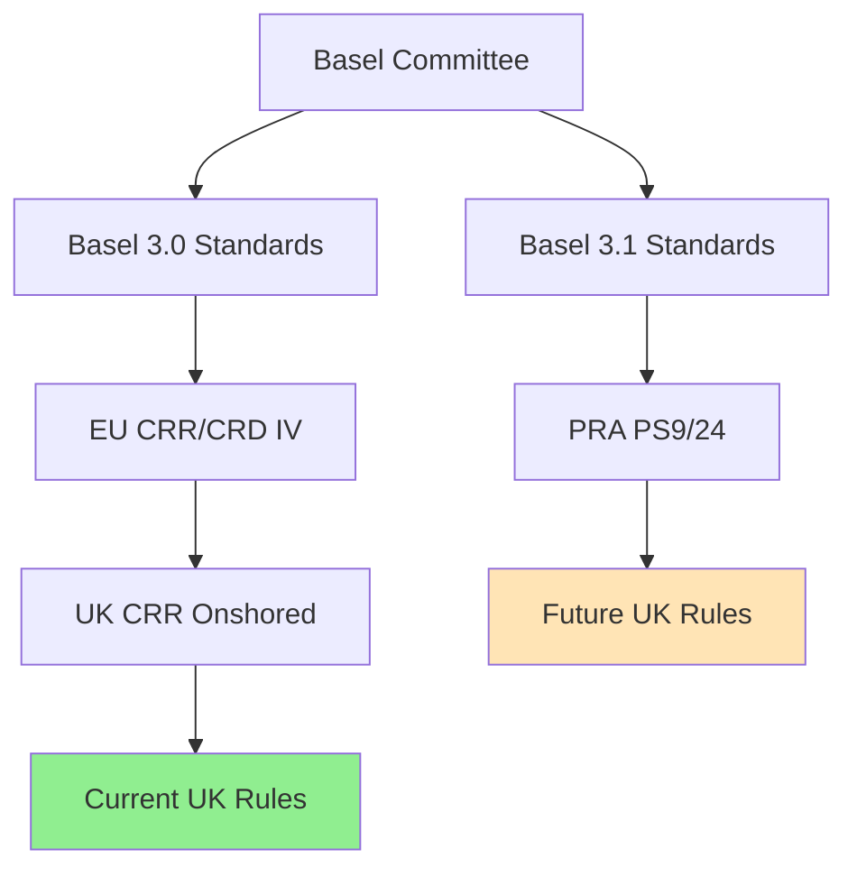

# Regulatory Frameworks

This section provides detailed information on the regulatory frameworks supported by the UK Credit Risk RWA Calculator.

## Overview

UK credit risk capital requirements are based on international Basel standards, as implemented by the Prudential Regulation Authority (PRA). The calculator supports two frameworks:

| Framework | Status | Effective Period | Primary Regulation |
|-----------|--------|------------------|-------------------|
| **CRR (Basel 3.0)** | Active | Until 31 Dec 2026 | UK CRR, PRA Rulebook |
| **Basel 3.1** | Planned | From 1 Jan 2027 | PRA PS9/24 |

## Regulatory Hierarchy



## Key Regulatory Documents

### Current Framework (CRR)

| Document | Description | Link |
|----------|-------------|------|
| UK CRR | EU 575/2013 as onshored | [legislation.gov.uk](https://www.legislation.gov.uk/eur/2013/575/contents) |
| PRA Rulebook - CRR Firms | PRA rules for CRR firms | [prarulebook.co.uk](https://www.prarulebook.co.uk/pra-rules/crr-firms) |

### Future Framework (Basel 3.1)

| Document | Description | Link |
|----------|-------------|------|
| PRA PS9/24 | Basel 3.1 implementation near-final rules | [bankofengland.co.uk](https://www.bankofengland.co.uk/prudential-regulation/publication/2024/september/implementation-of-the-basel-3-1-standards-near-final-policy-statement-part-2) |
| PRA CP16/22 | Basel 3.1 consultation paper | [bankofengland.co.uk](https://www.bankofengland.co.uk/prudential-regulation/publication/2022/november/implementation-of-the-basel-3-1-standards) |
| BCBS CRE Standards | Basel Committee credit risk standards | [bis.org](https://www.bis.org/basel_framework/standard/CRE.htm) |

## Framework Selection

The calculator automatically applies the correct rules based on your configuration:

```python
from datetime import date
from rwa_calc.contracts.config import CalculationConfig

# For current CRR rules
config = CalculationConfig.crr(reporting_date=date(2026, 12, 31))

# For Basel 3.1 rules
config = CalculationConfig.basel_3_1(reporting_date=date(2027, 1, 1))
```

## Key Differences Summary

| Feature | CRR | Basel 3.1 |
|---------|-----|-----------|
| **1.06 Scaling Factor** | Applied to all IRB | Removed |
| **Output Floor** | None | 72.5% of SA equivalent |
| **SME Supporting Factor** | 0.7619/0.85 tiered | Removed |
| **Infrastructure Factor** | 0.75 flat | Removed |
| **PD Floors** | 0.03% uniform | 0.03%-0.10% differentiated |
| **A-IRB LGD Floors** | None | 0%-25% by collateral |

## Detailed Framework Documentation

- [**CRR (Basel 3.0)**](crr.md) - Complete CRR documentation
- [**Basel 3.1**](basel31.md) - Complete Basel 3.1 documentation
- [**Framework Comparison**](comparison.md) - Detailed side-by-side comparison

## UK-Specific Deviations

The UK has implemented certain deviations from Basel standards:

### Institution Risk Weights

Under CRR, UK institutions apply a 30% risk weight for CQS2 institutions (vs. 50% standard Basel):

| CQS | Standard Basel | UK CRR |
|-----|----------------|--------|
| CQS1 | 20% | 20% |
| CQS2 | 50% | **30%** |
| CQS3 | 50% | 50% |

### Threshold Currency Conversion

EUR-denominated thresholds in regulations are converted to GBP:

| Threshold | EUR Amount | GBP Amount (@ 0.88) |
|-----------|------------|---------------------|
| SME turnover | EUR 50m | GBP 44m |
| SME exposure | EUR 2.5m | GBP 2.2m |
| Retail threshold | EUR 1m | GBP 880k |

The calculator automatically handles these conversions using the configured FX rate.

## Compliance Considerations

### Audit Trail

The calculator maintains full audit trails for regulatory compliance:
- All calculation inputs are logged
- Intermediate results are available
- Errors and warnings are accumulated (not thrown)
- Results can be exported for review

### Validation

Input data is validated against regulatory schemas:
- Exposure class constraints
- Rating scale mappings
- Threshold compliance
- Required field validation

### Documentation

All calculations reference specific regulatory articles:
- CRR Article numbers for current rules
- CRE chapter references for Basel 3.1
- PRA rulebook cross-references

## Next Steps

- [CRR Deep Dive](crr.md) - Current framework details
- [Basel 3.1 Deep Dive](basel31.md) - Future framework details
- [Comparison](comparison.md) - Framework differences
